# 🏗️ MFE Architecture Deep Dive

> **Complete Technical Documentation for Angular Micro Frontend Architecture with Native Federation**

---

## 📑 Table of Contents

1. [High-Level Architecture](#high-level-architecture)
2. [MFE Communication Diagram](#mfe-communication-diagram)
3. [Module Federation Flow](#module-federation-flow)
4. [Authentication Architecture](#authentication-architecture)
5. [Security Analysis](#security-analysis)
6. [Shared Library Architecture](#shared-library-architecture)
7. [Inter-MFE Communication Patterns](#inter-mfe-communication-patterns)
8. [Production Recommendations](#production-recommendations)

---

## High-Level Architecture

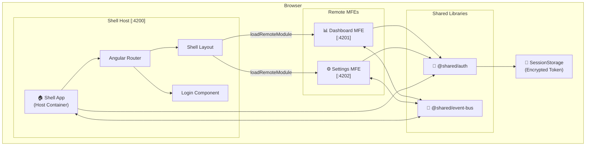

### Architecture Components

| Component | Role | Port |
|-----------|------|------|
| **mfe-shell** | Host container, manages layout, routing, authentication UI | 4200 |
| **mfe-dashboard** | Remote MFE for dashboard features, metrics, analytics | 4201 |
| **mfe-settings** | Remote MFE for user settings, preferences | 4202 |
| **@shared/auth** | Shared authentication library (singleton) | N/A |
| **@shared/event-bus** | Cross-MFE communication via RxJS | N/A |

---

## MFE Communication Diagram

### Runtime Loading Sequence

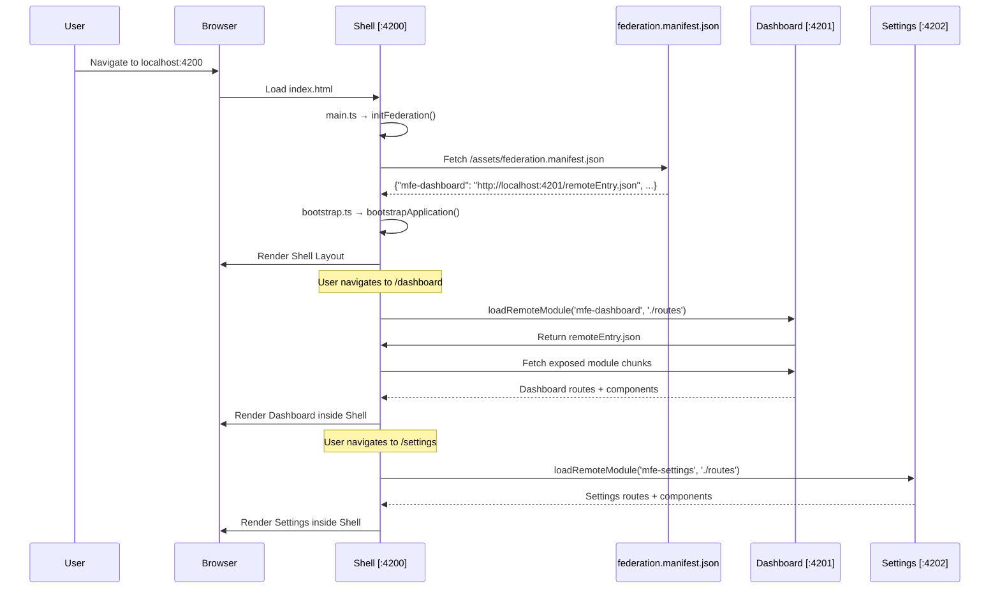

### Event-Based Communication

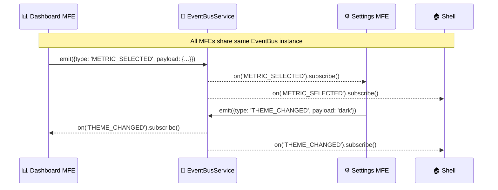

---

## Module Federation Flow

### Federation Configuration

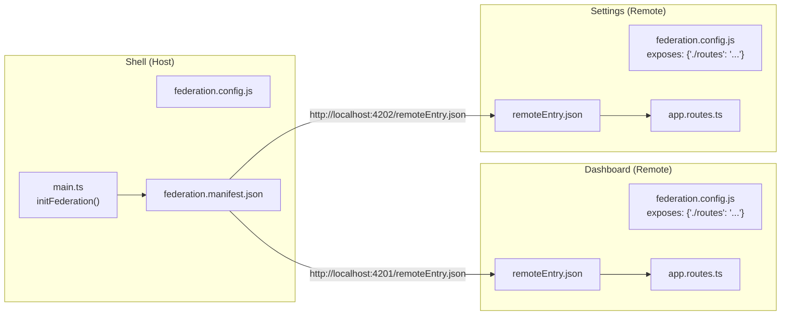

### How `shareAll` Works

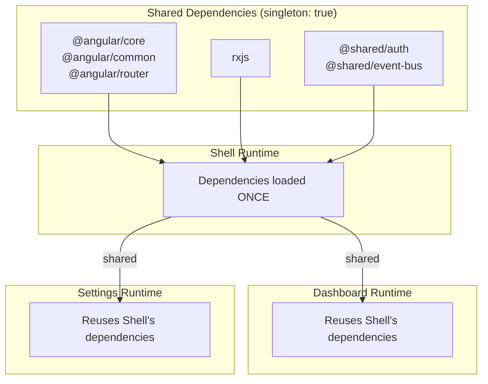

> [!IMPORTANT]
> **Singleton Pattern**: `shareAll({ singleton: true })` ensures only ONE instance of Angular, RxJS, and shared services exists across all MFEs. This is critical for authentication state sharing!

---

## Authentication Architecture

### Authentication Flow

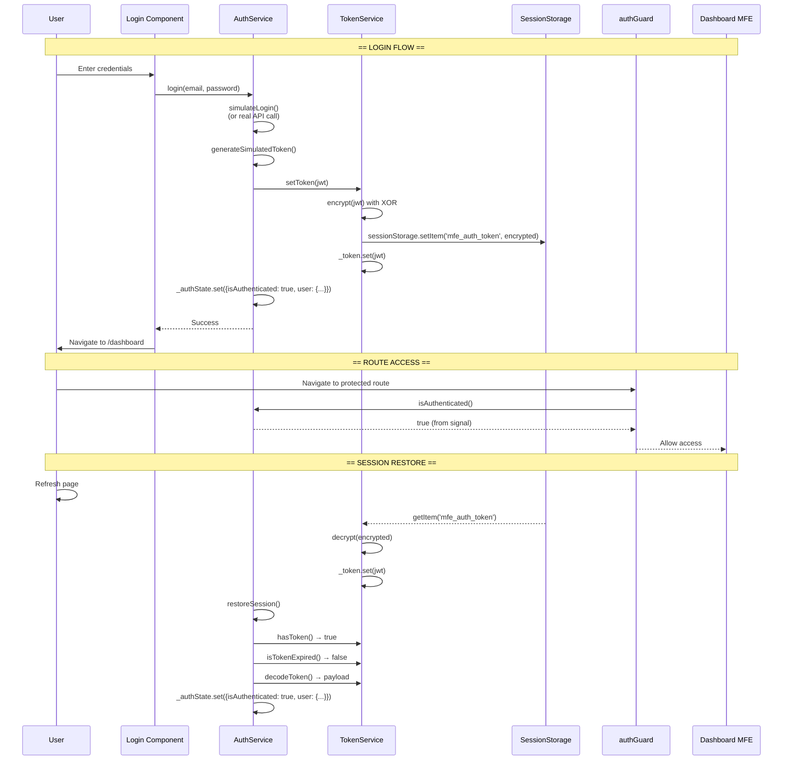

### Auth State Management

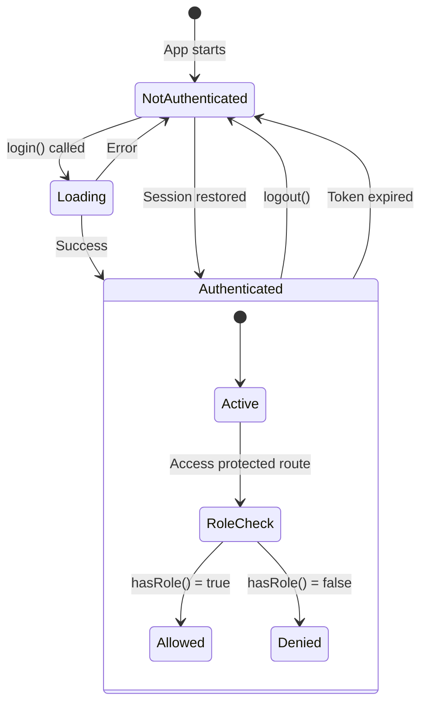

### Token Storage & Encryption

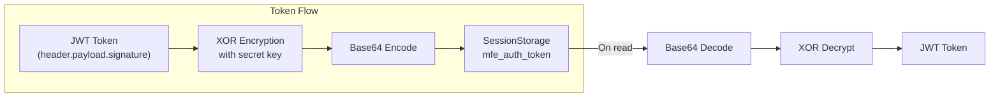

---

## Security Analysis

### Current Implementation

| Aspect | Current Approach | Security Level | Notes |
|--------|------------------|----------------|-------|
| **Token Storage** | SessionStorage | 🟡 Medium | Vulnerable to XSS |
| **Token Encryption** | XOR with fixed key | 🔴 Low | Key exposed in source |
| **Token Format** | Simulated JWT | 🟡 Demo Only | No real signature verification |
| **Session Lifetime** | Tab/Browser close | 🟢 Good | Tokens cleared on close |
| **Route Protection** | Functional guards | 🟢 Good | Proper Angular guards |
| **Role-Based Access** | Hierarchy-based | 🟢 Good | admin > manager > user > guest |

### Vulnerabilities

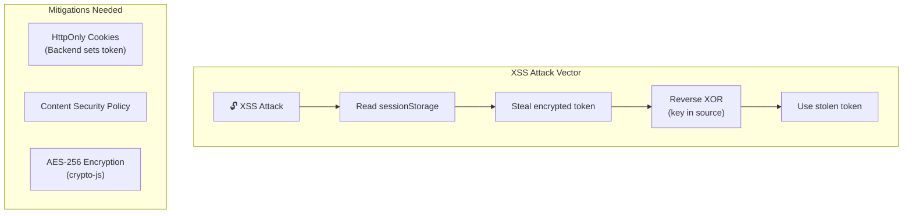

> [!CAUTION]
> **Critical Security Issues:**
> 1. XOR encryption key is hardcoded in source code (`ENCRYPTION_KEY = 'MFE_POC_SECRET_KEY_2024'`)
> 2. Client-side token storage is vulnerable to XSS attacks
> 3. JWT signature is simulated, not cryptographically verified

### Recommended Secure Architecture

```mermaid
sequenceDiagram
    participant User
    participant MFE as Any MFE
    participant Backend as Backend API
    participant TokenStore as HttpOnly Cookie
    
    User->>MFE: Login with credentials
    MFE->>Backend: POST /auth/login {email, password}
    Backend->>Backend: Validate credentials
    Backend->>Backend: Generate JWT (signed with secret)
    Backend->>TokenStore: Set-Cookie: token=jwt; HttpOnly; Secure; SameSite=Strict
    Backend-->>MFE: 200 OK (no token in body!)
    
    Note over MFE,Backend: Subsequent requests
    
    MFE->>Backend: GET /api/resource (Cookie auto-attached)
    Backend->>Backend: Verify JWT signature
    Backend-->>MFE: Protected data
    
    Note over User,TokenStore: XSS cannot access HttpOnly cookie!
```

---

## Shared Library Architecture

### Library Structure

```
shared/
├── auth/
│   ├── index.ts            # Barrel file (public API)
│   ├── package.json        # Library metadata
│   ├── auth.service.ts     # Main auth service
│   ├── token.service.ts    # Token management
│   ├── auth.guard.ts       # Route guards
│   ├── role.guard.ts       # RBAC guards
│   ├── auth.interceptor.ts # HTTP interceptor
│   └── auth.models.ts      # Type definitions
│
├── event-bus/
│   ├── index.ts            # Barrel file
│   ├── package.json        # Library metadata
│   ├── event-bus.service.ts    # RxJS-based bus
│   ├── custom-event.service.ts # Browser CustomEvent alternative
│   └── event.models.ts     # Event type definitions
```

### How Libraries Are Shared

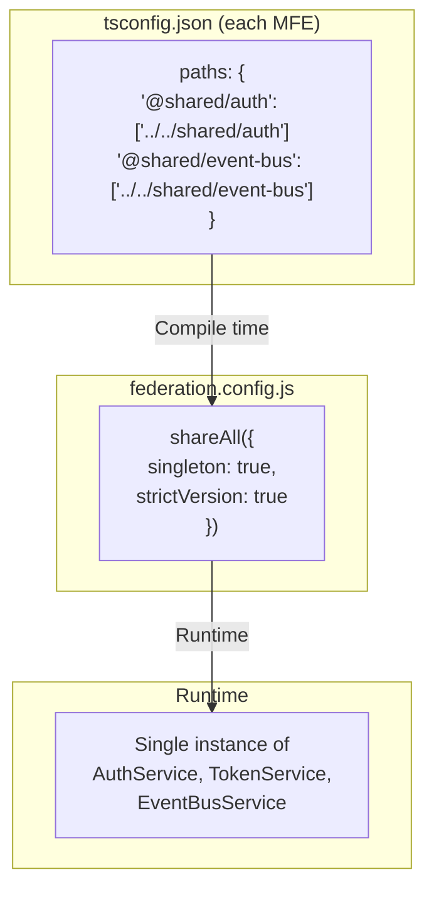

### Import Pattern

```typescript
// All MFEs use the same clean import
import { AuthService, authGuard, roleGuard } from '@shared/auth';
import { EventBusService } from '@shared/event-bus';

// The path alias resolves to actual file location
// tsconfig.json: "@shared/auth" → "../../shared/auth/index.ts"
```

> [!TIP]
> **Barrel Files** (`index.ts`) provide:
> - Clean imports (`from '@shared/auth'` instead of `from '../../shared/auth/auth.service'`)
> - Encapsulation (hide internal file structure)
> - Controlled public API (only export what's needed)

---

## Inter-MFE Communication Patterns

### Pattern 1: EventBus (RxJS Subject)

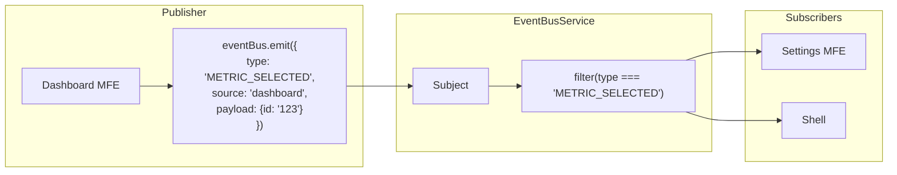

**Pros:** Type-safe, Angular-native, supports operators  
**Cons:** Memory leaks if subscriptions not cleaned up

### Pattern 2: Browser CustomEvents

```typescript
// Emitter (Dashboard)
window.dispatchEvent(new CustomEvent('mfe:metric-selected', {
  detail: { metricId: '123' }
}));

// Listener (Settings)
window.addEventListener('mfe:metric-selected', (event) => {
  console.log(event.detail.metricId);
});
```

**Pros:** Works across any framework, persists across MFE boundaries  
**Cons:** No type safety, manual cleanup required

### Pattern 3: Shared State via Signals

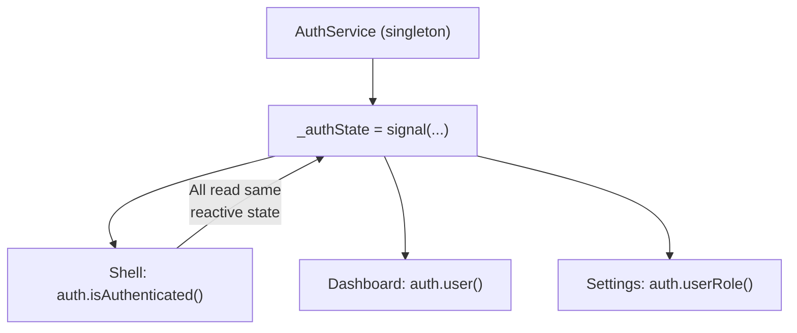

**Pros:** Reactive, no subscriptions to manage, Angular 19+ optimized  
**Cons:** Only for state, not events

---

## Production Recommendations

### Security Hardening

| Issue | Solution | Priority |
|-------|----------|----------|
| Client-side token storage | Use HttpOnly cookies set by backend | 🔴 Critical |
| XOR encryption | Use proper crypto (AES-256) or avoid client encryption | 🔴 Critical |
| JWT verification | Backend-only signature verification | 🔴 Critical |
| XSS protection | Implement strict CSP headers | 🟡 High |
| CSRF protection | Use SameSite cookies + CSRF tokens | 🟡 High |

### Architecture Improvements

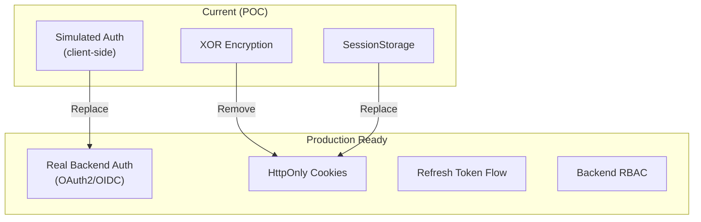

### Recommended Token Flow

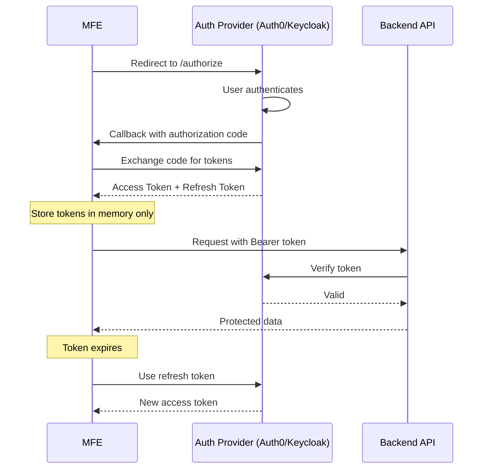

---

## Summary

### What This Architecture Achieves

✅ **Independent Deployment**: Each MFE can be built and deployed separately  
✅ **Shared Authentication**: Single auth state across all MFEs  
✅ **Loose Coupling**: MFEs communicate via events, not direct imports  
✅ **Technology Agnostic**: Native Federation works with any framework  
✅ **Runtime Integration**: No rebuild of shell required for remote updates  

### Key Files Reference

| File | Purpose |
|------|---------|
| `mfe-shell/src/main.ts` | Federation initialization |
| `mfe-shell/src/assets/federation.manifest.json` | Remote MFE URLs |
| `*/federation.config.js` | Federation configuration |
| `shared/auth/auth.service.ts` | Central authentication |
| `shared/auth/token.service.ts` | Token storage and encryption |
| `shared/event-bus/event-bus.service.ts` | Cross-MFE events |

---

> **Last Updated**: January 2026  
> **Version**: 1.0.0  
> **Architecture**: Angular 19 + Native Federation 19
