# 🏗️ MFE Architecture Deep Dive

> **Complete Technical Documentation for Angular Micro Frontend Architecture with Native Federation**

---

## 📑 Table of Contents

1. [High-Level Architecture](#high-level-architecture)
2. [MFE Communication Diagram](#mfe-communication-diagram)
3. [Module Federation Flow](#module-federation-flow)
4. [Authentication Architecture](#authentication-architecture)
5. [Security Analysis](#security-analysis)
6. [Shared Library Architecture](#shared-library-architecture)
7. [Inter-MFE Communication Patterns](#inter-mfe-communication-patterns)
8. [Domain-Based Modularization](#domain-based-modularization)
9. [Enterprise Angular Patterns](#enterprise-angular-patterns)
10. [Modular Design Patterns](#modular-design-patterns)
11. [Service Layer / Domain-Driven Structure](#service-layer--domain-driven-structure)
12. [State Management Patterns](#state-management-patterns)
13. [Adapter and Proxy Patterns](#adapter-and-proxy-patterns)
14. [Production Recommendations](#production-recommendations)

---

## High-Level Architecture

```mermaid
graph TB
    subgraph "Browser"
        subgraph "Shell Host [:4200]"
            ShellApp["🏠 Shell App<br/>(Host Container)"]
            Router["Angular Router"]
            Layout["Shell Layout"]
            AuthUI["Login Component"]
        end
        
        subgraph "Remote MFEs"
            Dashboard["📊 Dashboard MFE<br/>[:4201]"]
            Settings["⚙️ Settings MFE<br/>[:4202]"]
        end
        
        subgraph "Shared Libraries"
            AuthLib["🔐 @shared/auth"]
            EventBus["📡 @shared/event-bus"]
        end
        
        Storage["💾 SessionStorage<br/>(Encrypted Token)"]
    end
    
    ShellApp --> Router
    Router --> Layout
    Router --> AuthUI
    Layout --> |"loadRemoteModule"| Dashboard
    Layout --> |"loadRemoteModule"| Settings
    
    Dashboard --> AuthLib
    Settings --> AuthLib
    ShellApp --> AuthLib
    
    Dashboard <--> EventBus
    Settings <--> EventBus
    ShellApp <--> EventBus
    
    AuthLib --> Storage
```



### Architecture Components

| Component | Role | Port |
|-----------|------|------|
| **mfe-shell** | Host container, manages layout, routing, authentication UI | 4200 |
| **mfe-dashboard** | Remote MFE for dashboard features, metrics, analytics | 4201 |
| **mfe-settings** | Remote MFE for user settings, preferences | 4202 |
| **@shared/auth** | Shared authentication library (singleton) | N/A |
| **@shared/event-bus** | Cross-MFE communication via RxJS | N/A |

---

## MFE Communication Diagram

### Runtime Loading Sequence


### Event-Based Communication

```mermaid
sequenceDiagram
    participant Dashboard as 📊 Dashboard MFE
    participant EventBus as 📡 EventBusService
    participant Settings as ⚙️ Settings MFE
    participant Shell as 🏠 Shell
    
    Note over Dashboard,Shell: All MFEs share same EventBus instance
    
    Dashboard->>EventBus: emit({type: 'METRIC_SELECTED', payload: {...}})
    EventBus-->>Settings: on('METRIC_SELECTED').subscribe()
    EventBus-->>Shell: on('METRIC_SELECTED').subscribe()
    
    Settings->>EventBus: emit({type: 'THEME_CHANGED', payload: 'dark'})
    EventBus-->>Dashboard: on('THEME_CHANGED').subscribe()
    EventBus-->>Shell: on('THEME_CHANGED').subscribe()
```



---

## Module Federation Flow

### Federation Configuration


### How `shareAll` Works


> [!IMPORTANT]
> **Singleton Pattern**: `shareAll({ singleton: true })` ensures only ONE instance of Angular, RxJS, and shared services exists across all MFEs. This is critical for authentication state sharing!

---

## Authentication Architecture

### Authentication Flow

```mermaid
sequenceDiagram
    participant User
    participant LoginUI as Login Component
    participant AuthService as AuthService
    participant TokenService as TokenService
    participant Storage as SessionStorage
    participant Guard as authGuard
    participant Dashboard as Dashboard MFE
    
    Note over User,Dashboard: == LOGIN FLOW ==
    
    User->>LoginUI: Enter credentials
    LoginUI->>AuthService: login(email, password)
    AuthService->>AuthService: simulateLogin()<br/>(or real API call)
    AuthService->>AuthService: generateSimulatedToken()
    AuthService->>TokenService: setToken(jwt)
    TokenService->>TokenService: encrypt(jwt) with XOR
    TokenService->>Storage: sessionStorage.setItem('mfe_auth_token', encrypted)
    TokenService->>TokenService: _token.set(jwt)
    AuthService->>AuthService: _authState.set({isAuthenticated: true, user: {...}})
    AuthService-->>LoginUI: Success
    LoginUI->>User: Navigate to /dashboard
    
    Note over User,Dashboard: == ROUTE ACCESS ==
    
    User->>Guard: Navigate to protected route
    Guard->>AuthService: isAuthenticated()
    AuthService-->>Guard: true (from signal)
    Guard-->>Dashboard: Allow access
    
    Note over User,Dashboard: == SESSION RESTORE ==
    
    User->>User: Refresh page
    Storage-->>TokenService: getItem('mfe_auth_token')
    TokenService->>TokenService: decrypt(encrypted)
    TokenService->>TokenService: _token.set(jwt)
    AuthService->>AuthService: restoreSession()
    AuthService->>TokenService: hasToken() → true
    AuthService->>TokenService: isTokenExpired() → false
    AuthService->>TokenService: decodeToken() → payload
    AuthService->>AuthService: _authState.set({isAuthenticated: true, user: {...}})
```



### Auth State Management


### Token Storage & Encryption


---

## Security Analysis

### Current Implementation

| Aspect | Current Approach | Security Level | Notes |
|--------|------------------|----------------|-------|
| **Token Storage** | SessionStorage | 🟡 Medium | Vulnerable to XSS |
| **Token Encryption** | XOR with fixed key | 🔴 Low | Key exposed in source |
| **Token Format** | Simulated JWT | 🟡 Demo Only | No real signature verification |
| **Session Lifetime** | Tab/Browser close | 🟢 Good | Tokens cleared on close |
| **Route Protection** | Functional guards | 🟢 Good | Proper Angular guards |
| **Role-Based Access** | Hierarchy-based | 🟢 Good | admin > manager > user > guest |

### Vulnerabilities

```mermaid
flowchart TB
    subgraph "XSS Attack Vector"
        Attack["🔓 XSS Attack"]
        ReadStorage["Read sessionStorage"]
        StealToken["Steal encrypted token"]
        ReverseXOR["Reverse XOR<br/>(key in source)"]
        UseToken["Use stolen token"]
    end
    
    Attack --> ReadStorage --> StealToken --> ReverseXOR --> UseToken
    
    subgraph "Mitigations Needed"
        HttpOnly["HttpOnly Cookies<br/>(Backend sets token)"]
        CSP["Content Security Policy"]
        ProperCrypto["AES-256 Encryption<br/>(crypto-js)"]
    end
```



> [!CAUTION]
> **Critical Security Issues:**
> 1. XOR encryption key is hardcoded in source code (`ENCRYPTION_KEY = 'MFE_POC_SECRET_KEY_2024'`)
> 2. Client-side token storage is vulnerable to XSS attacks
> 3. JWT signature is simulated, not cryptographically verified

### Recommended Secure Architecture

```mermaid
sequenceDiagram
    participant User
    participant MFE as Any MFE
    participant Backend as Backend API
    participant TokenStore as HttpOnly Cookie
    
    User->>MFE: Login with credentials
    MFE->>Backend: POST /auth/login {email, password}
    Backend->>Backend: Validate credentials
    Backend->>Backend: Generate JWT (signed with secret)
    Backend->>TokenStore: Set-Cookie: token=jwt; HttpOnly; Secure; SameSite=Strict
    Backend-->>MFE: 200 OK (no token in body!)
    
    Note over MFE,Backend: Subsequent requests
    
    MFE->>Backend: GET /api/resource (Cookie auto-attached)
    Backend->>Backend: Verify JWT signature
    Backend-->>MFE: Protected data
    
    Note over User,TokenStore: XSS cannot access HttpOnly cookie!
```

---

## Shared Library Architecture

### Library Structure

```
shared/
├── auth/
│   ├── index.ts            # Barrel file (public API)
│   ├── package.json        # Library metadata
│   ├── auth.service.ts     # Main auth service
│   ├── token.service.ts    # Token management
│   ├── auth.guard.ts       # Route guards
│   ├── role.guard.ts       # RBAC guards
│   ├── auth.interceptor.ts # HTTP interceptor
│   └── auth.models.ts      # Type definitions
│
├── event-bus/
│   ├── index.ts            # Barrel file
│   ├── package.json        # Library metadata
│   ├── event-bus.service.ts    # RxJS-based bus
│   ├── custom-event.service.ts # Browser CustomEvent alternative
│   └── event.models.ts     # Event type definitions
```

### How Libraries Are Shared


### Import Pattern

```typescript
// All MFEs use the same clean import
import { AuthService, authGuard, roleGuard } from '@shared/auth';
import { EventBusService } from '@shared/event-bus';

// The path alias resolves to actual file location
// tsconfig.json: "@shared/auth" → "../../shared/auth/index.ts"
```

> [!TIP]
> **Barrel Files** (`index.ts`) provide:
> - Clean imports (`from '@shared/auth'` instead of `from '../../shared/auth/auth.service'`)
> - Encapsulation (hide internal file structure)
> - Controlled public API (only export what's needed)

---

## Inter-MFE Communication Patterns

### Pattern 1: EventBus (RxJS Subject)


**Pros:** Type-safe, Angular-native, supports operators  
**Cons:** Memory leaks if subscriptions not cleaned up

### Pattern 2: Browser CustomEvents

```typescript
// Emitter (Dashboard)
window.dispatchEvent(new CustomEvent('mfe:metric-selected', {
  detail: { metricId: '123' }
}));

// Listener (Settings)
window.addEventListener('mfe:metric-selected', (event) => {
  console.log(event.detail.metricId);
});
```

**Pros:** Works across any framework, persists across MFE boundaries  
**Cons:** No type safety, manual cleanup required

### Pattern 3: Shared State via Signals


**Pros:** Reactive, no subscriptions to manage, Angular 19+ optimized  
**Cons:** Only for state, not events

---

## Domain-Based Modularization

This project follows **Domain-Driven Design (DDD)** principles, where each MFE represents a distinct business domain (bounded context).

### Domain-to-Project Mapping

```mermaid
flowchart TB
    subgraph "Domain: Orchestration"
        Shell["🏠 mfe-shell<br/>Routing, Layout, MFE Coordination"]
    end
    
    subgraph "Domain: Analytics & Reporting"
        Dashboard["📊 mfe-dashboard<br/>Metrics, Charts, Business Intelligence"]
    end
    
    subgraph "Domain: User Management"
        Settings["⚙️ mfe-settings<br/>Profile, Preferences, Notifications"]
    end
    
    subgraph "Domain: Cross-Cutting Concerns"
        Auth["🔐 shared/auth<br/>Identity & Access Management"]
        EventBus["📡 shared/event-bus<br/>Inter-domain Communication"]
    end
    
    Shell --> Dashboard
    Shell --> Settings
    Dashboard --> Auth
    Settings --> Auth
    Dashboard <--> EventBus
    Settings <--> EventBus
```



### Bounded Context Mapping

| Domain | Project | Responsibility | Key Features |
|--------|---------|----------------|--------------|
| **Identity/Auth** | `shared/auth` | User identity, authentication, authorization | Login, guards, RBAC, token management |
| **Analytics** | `mfe-dashboard` | Business intelligence, metrics visualization | Charts, KPIs, reports, analytics |
| **User Management** | `mfe-settings` | User preferences, profile management | Profile editing, preferences, notifications |
| **Orchestration** | `mfe-shell` | Application shell, routing, layout | Navigation, remote loading, fallbacks |
| **Communication** | `shared/event-bus` | Cross-domain messaging | Pub/sub, custom events, debugging |

### Feature-First Folder Structure

Each MFE follows a **feature-first** organization within its domain:

```
mfe-{domain}/
└── src/app/
    ├── features/                    # Domain features
    │   ├── feature-a/
    │   │   ├── feature-a.component.ts
    │   │   ├── feature-a.component.html
    │   │   └── feature-a.component.scss
    │   └── feature-b/
    │       └── ...
    ├── standalone/                  # Standalone mode entry
    └── app.routes.ts                # Domain routes
```

### Current Feature Organization

```
mfe-shell/src/app/features/
├── auth/                # Login UI
├── dashboard/           # Fallback for remote failure
├── settings/            # Fallback for remote failure
└── unauthorized/        # Access denied page

mfe-dashboard/src/app/features/
├── analytics/           # Charts, metric analysis
├── overview/            # Dashboard overview widgets
└── dashboard-layout/    # Domain-specific layout

mfe-settings/src/app/features/
├── profile/             # User profile management
├── preferences/         # App preferences
├── event-monitor/       # Debug/monitoring tools
└── settings-layout/     # Domain-specific layout
```

> [!TIP]
> **Vertical Slice Architecture**: Each feature folder is self-contained with its component, template, and styles. This enables independent development and testing of features within each domain.

### Benefits of Domain Modularization

1. **Team Autonomy** - Each domain can be owned by a separate team
2. **Independent Deployment** - Deploy one domain without affecting others
3. **Clear Boundaries** - Well-defined interfaces between domains
4. **Scalability** - Add new domains without restructuring existing code
5. **Maintainability** - Changes are isolated to their respective domain

---

## Enterprise Angular Patterns

This project implements key Angular enterprise patterns for scalability and maintainability.

### Implementation Status

| Pattern | Status | Evidence |
|---------|--------|----------|
| **Feature Modules with Public APIs** | ✅ Implemented | `shared/auth/index.ts`, `shared/event-bus/index.ts`, `shared/patterns/index.ts` |
| **Facade Pattern** | ✅ Implemented | `AuthService` hides TokenService, JWT, storage complexity |
| **Smart / Presentational** | ✅ Implemented | `MetricCardComponent` in `shared/patterns/` |
| **Domain-Driven Foldering & Barrels** | ✅ Implemented | Clean imports via `@shared/auth`, `@shared/event-bus`, `@shared/patterns` |
| **Route-Level Lazy Loading** | ✅ Implemented | `loadRemoteModule()` in `app.routes.ts` |
| **Adapter Pattern** | ✅ Implemented | `UserAdapter`, `MetricsAdapter` in `shared/patterns/` |
| **Proxy Pattern (Caching)** | ✅ Implemented | `CachingProxyService` in `shared/patterns/` |

### Feature Modules with Clear Public APIs

Each shared library exposes a **public API** via barrel files (`index.ts`):

```typescript
// shared/auth/index.ts - PUBLIC API
// ✅ Explicitly export only what consumers need

// Services
export { AuthService } from './auth.service';
export { TokenService } from './token.service';

// Guards
export { authGuard, publicGuard } from './auth.guard';
export { roleGuard } from './role.guard';

// Interceptors
export { authInterceptor } from './auth.interceptor';

// Models (types only, not implementation details)
export { User, UserRole, AuthState, LoginCredentials } from './auth.models';

// ❌ NOT exported: DEMO_USERS, ENCRYPTION_KEY, internal helpers
```

> [!IMPORTANT]
> **Encapsulation Principle**: Only export what's needed. Internal helpers, constants, and implementation details stay private.

### Facade Pattern for State and Side Effects

The `AuthService` acts as a **Facade** - hiding complexity behind a simple interface:


**Facade Benefits:**
- Components only interact with simple methods
- Complex logic is encapsulated and testable
- Easy to swap implementations (mock vs. real API)

### Smart / Presentational Components Separation


| Smart Components | Presentational Components |
|-----------------|---------------------------|
| Know about services | No service dependencies |
| Handle subscriptions | Receive data via `@Input()` |
| Manage side effects | Emit events via `@Output()` |
| Connected to store/state | Pure, stateless rendering |
| Less reusable | Highly reusable |

### Domain-Driven Foldering and Barrels

```
shared/
├── auth/
│   ├── index.ts            # 👈 Barrel: Public API
│   ├── auth.service.ts     # Facade
│   ├── token.service.ts    # Internal service
│   ├── auth.guard.ts       # Route guards
│   ├── role.guard.ts       # RBAC guards
│   ├── auth.interceptor.ts # HTTP interceptor
│   └── auth.models.ts      # Type definitions
│
└── event-bus/
    ├── index.ts            # 👈 Barrel: Public API
    ├── event-bus.service.ts
    ├── custom-event.service.ts
    └── event.models.ts

# Usage across all MFEs (clean imports via barrel):
import { AuthService, authGuard } from '@shared/auth';
import { EventBusService } from '@shared/event-bus';
```

**Barrel File Benefits:**
- Clean imports (`from '@shared/auth'` not `from '../../shared/auth/auth.service'`)
- Encapsulation (internal structure hidden)
- Refactoring safety (move files without breaking imports)
- Tree-shaking support (unused exports removed)

### Route-Level Lazy Loading and Bundle Boundaries


**Route Configuration with Lazy Loading:**

```typescript
// mfe-shell/src/app/app.routes.ts
export const routes: Routes = [
    {
        path: 'dashboard',
        // 👇 Bundle boundary - loaded only when route is accessed
        loadChildren: () => loadRemoteModule('mfe-dashboard', './routes')
            .then(m => m.routes)
    },
    {
        path: 'settings',
        // 👇 Separate bundle - independent loading
        loadChildren: () => loadRemoteModule('mfe-settings', './routes')
            .then(m => m.routes)
    }
];
```

**Bundle Strategy:**

| Bundle | Loading Strategy | Size Impact |
|--------|-----------------|-------------|
| Shell | Eager (initial) | Minimal - only shell + login |
| Dashboard MFE | Lazy (on route) | Loaded when user navigates |
| Settings MFE | Lazy (on route) | Loaded when user navigates |
| Shared libs | Singleton shared | One copy for all MFEs |

> [!TIP]
> **Performance Benefit**: Users only download the code they need. Initial load is fast (shell only), and MFEs load on-demand.

---

## Modular Design Patterns

### Core, Shared, and Feature Modules


| Module Type | Purpose | Import Location | Example |
|-------------|---------|-----------------|---------|
| **Core** | Singleton services, app-wide config | Root module only | `AuthService`, `LoggingService` |
| **Shared** | Reusable UI components, pipes, directives | Any feature module | `ButtonComponent`, `DatePipe` |
| **Feature** | Business domain functionality | Lazy loaded on route | `mfe-dashboard`, `mfe-settings` |

### Implementation in This Project

| Module Type | Implementation | Files |
|-------------|---------------|-------|
| **Core** | `@shared/auth`, `@shared/event-bus` | Singleton services via `providedIn: 'root'` |
| **Shared** | Barrel exports | `shared/auth/index.ts`, `shared/event-bus/index.ts` |
| **Feature** | Each MFE | `mfe-dashboard`, `mfe-settings` |

---

## Service Layer / Domain-Driven Structure

Organizing code around **business domains** instead of technical function:

```
✅ DOMAIN-DRIVEN (Recommended)          ❌ TECHNICAL-DRIVEN (Avoid)
├── user/                               ├── components/
│   ├── user.component.ts               │   ├── user.component.ts
│   ├── user.service.ts                 │   ├── order.component.ts
│   ├── user.model.ts                   ├── services/
│   └── user.guard.ts                   │   ├── user.service.ts
├── order/                              │   ├── order.service.ts
│   ├── order.component.ts              ├── models/
│   ├── order.service.ts                │   ├── user.model.ts
│   └── order.model.ts                  │   └── order.model.ts
```

**Benefits:**
- Clear ownership boundaries for teams
- Easier to understand and navigate
- Better encapsulation and modularity
- Supports micro frontend extraction

---

## State Management Patterns

### Signal-Based State (This Project)

```typescript
// AuthService - Signal-based state management
private _authState = signal<AuthState>(INITIAL_AUTH_STATE);

// Public readonly signals
readonly isAuthenticated = computed(() => this._authState().isAuthenticated);
readonly user = computed(() => this._authState().user);
readonly userRole = computed(() => this._authState().user?.role ?? null);
```

### NgRx Pattern (For Complex State)


| Approach | Use Case | Complexity | This Project |
|----------|----------|------------|--------------|
| **Signals** | Simple/medium state | Low | ✅ Used |
| **NgRx** | Complex cross-feature state | High | ❌ Not needed |
| **Services + RxJS** | Medium state | Medium | ✅ EventBus uses this |

---

## Adapter and Proxy Patterns

### Adapter Pattern (Data Transformation)

The **Adapter** pattern transforms data from one format to another:

```typescript
// API returns snake_case, app uses camelCase
interface ApiUser {
    user_id: string;
    first_name: string;
    last_name: string;
}

interface User {
    userId: string;
    firstName: string;
    lastName: string;
}

// UserAdapter - transforms API response to app model
class UserAdapter {
    static toUser(apiUser: ApiUser): User {
        return {
            userId: apiUser.user_id,
            firstName: apiUser.first_name,
            lastName: apiUser.last_name
        };
    }
}
```

### Proxy Pattern (Caching/Authorization)

The **Proxy** pattern adds extra functionality (caching, logging, auth) to service calls:

```typescript
// CachingProxy - adds caching to HTTP calls
@Injectable({ providedIn: 'root' })
export class CachingApiProxy {
    private cache = new Map<string, { data: any; expiry: number }>();
    
    constructor(private http: HttpClient) {}
    
    get<T>(url: string, ttl = 60000): Observable<T> {
        const cached = this.cache.get(url);
        if (cached && cached.expiry > Date.now()) {
            return of(cached.data);  // Return cached data
        }
        
        return this.http.get<T>(url).pipe(
            tap(data => this.cache.set(url, { data, expiry: Date.now() + ttl }))
        );
    }
}
```

### Implementation in This Project

| Pattern | Implementation | File |
|---------|---------------|------|
| **Adapter** | UserAdapter, MetricsAdapter | [api-adapter.ts](file:///d:/MyPOC/Angular/AngularMFE/shared/patterns/api-adapter.ts) |
| **Proxy (Caching)** | CachingProxyService | [caching-proxy.service.ts](file:///d:/MyPOC/Angular/AngularMFE/shared/patterns/caching-proxy.service.ts) |
| **Proxy (Auth)** | Auth interceptor (adds tokens) | [auth.interceptor.ts](file:///d:/MyPOC/Angular/AngularMFE/shared/auth/auth.interceptor.ts) |
| **Presentational** | MetricCardComponent | [metric-card.component.ts](file:///d:/MyPOC/Angular/AngularMFE/shared/patterns/metric-card.component.ts) |

> [!TIP]
> Import these patterns via: `import { UserAdapter, CachingProxyService, MetricCardComponent } from '@shared/patterns';`

---

## Production Recommendations

### Security Hardening

| Issue | Solution | Priority |
|-------|----------|----------|
| Client-side token storage | Use HttpOnly cookies set by backend | 🔴 Critical |
| XOR encryption | Use proper crypto (AES-256) or avoid client encryption | 🔴 Critical |
| JWT verification | Backend-only signature verification | 🔴 Critical |
| XSS protection | Implement strict CSP headers | 🟡 High |
| CSRF protection | Use SameSite cookies + CSRF tokens | 🟡 High |

### Architecture Improvements


### Recommended Token Flow

```mermaid
sequenceDiagram
    participant MFE
    participant Auth0 as Auth Provider (Auth0/Keycloak)
    participant API as Backend API
    
    MFE->>Auth0: Redirect to /authorize
    Auth0->>Auth0: User authenticates
    Auth0->>MFE: Callback with authorization code
    MFE->>Auth0: Exchange code for tokens
    Auth0-->>MFE: Access Token + Refresh Token
    Note over MFE: Store tokens in memory only
    
    MFE->>API: Request with Bearer token
    API->>Auth0: Verify token
    Auth0-->>API: Valid
    API-->>MFE: Protected data
    
    Note over MFE: Token expires
    MFE->>Auth0: Use refresh token
    Auth0-->>MFE: New access token
```

---

## Summary

### What This Architecture Achieves

✅ **Independent Deployment**: Each MFE can be built and deployed separately  
✅ **Shared Authentication**: Single auth state across all MFEs  
✅ **Loose Coupling**: MFEs communicate via events, not direct imports  
✅ **Technology Agnostic**: Native Federation works with any framework  
✅ **Runtime Integration**: No rebuild of shell required for remote updates  

### Key Files Reference

| File | Purpose |
|------|---------|
| `mfe-shell/src/main.ts` | Federation initialization |
| `mfe-shell/src/assets/federation.manifest.json` | Remote MFE URLs |
| `*/federation.config.js` | Federation configuration |
| `shared/auth/auth.service.ts` | Central authentication |
| `shared/auth/token.service.ts` | Token storage and encryption |
| `shared/event-bus/event-bus.service.ts` | Cross-MFE events |

---

> **Last Updated**: January 2026  
> **Version**: 1.0.0  
> **Architecture**: Angular 19 + Native Federation 19
