# 🔐 Authentication in MFE Architecture

> **Detailed Guide: How Auth Works in Standalone, Host, and Remote Modes**

---

## 📑 Table of Contents

1. [Overview: Three Modes of Operation](#overview-three-modes-of-operation)
2. [Mode 1: Standalone (Independent Development)](#mode-1-standalone-independent-development)
3. [Mode 2: Host (Shell Application)](#mode-2-host-shell-application)
4. [Mode 3: Remote (MFE Loaded in Shell)](#mode-3-remote-mfe-loaded-in-shell)
5. [The Magic: Singleton Services via Module Federation](#the-magic-singleton-services-via-module-federation)
6. [Complete Authentication Flow Diagram](#complete-authentication-flow-diagram)
7. [Code Walkthrough](#code-walkthrough)

---

## Overview: Three Modes of Operation

Each MFE can run in **multiple modes**, and authentication behaves differently in each:

```mermaid
flowchart TB
    subgraph "Three Modes of Operation"
        Standalone["📱 STANDALONE MODE<br/>MFE runs independently<br/>npm start in mfe-dashboard"]
        Host["🏠 HOST MODE<br/>Shell runs as container<br/>npm start in mfe-shell"]
        Remote["🔌 REMOTE MODE<br/>MFE loaded inside Shell<br/>via Module Federation"]
    end
    
    subgraph "Auth Behavior"
        StandaloneAuth["Own login page<br/>Own auth state<br/>Direct AuthService usage"]
        HostAuth["Shell's login page<br/>Manages all auth<br/>Stores tokens"]
        RemoteAuth["NO login page<br/>REUSES Shell's auth<br/>Same AuthService instance!"]
    end
    
    Standalone --> StandaloneAuth
    Host --> HostAuth
    Remote --> RemoteAuth
```



---

## Mode 1: Standalone (Independent Development)

### When This Happens
- Developer runs `npm start` in `mfe-dashboard/` or `mfe-settings/`
- MFE runs on its own port (4201 or 4202)
- No Shell is involved

### How Auth Works


### Key Files Involved

| File | Purpose |
|------|---------|
| [mfe-dashboard/src/app/app.routes.ts](file:///d:/MyPOC/Angular/AngularMFE/mfe-dashboard/src/app/app.routes.ts) | Includes `/login` path for standalone mode |
| [mfe-dashboard/src/app/standalone/standalone-login.component.ts](file:///d:/MyPOC/Angular/AngularMFE/mfe-dashboard/src/app/standalone/standalone-login.component.ts) | Simplified login UI for developers |
| [shared/auth/auth.service.ts](file:///d:/MyPOC/Angular/AngularMFE/shared/auth/auth.service.ts) | Same AuthService as Shell uses |

### Route Configuration in Standalone

```typescript
// mfe-dashboard/src/app/app.routes.ts
export const routes: Routes = [
    // ===================================================================
    // STANDALONE MODE: Login for independent development
    // ===================================================================
    {
        path: 'login',
        loadComponent: () => import('./standalone/standalone-login.component')
            .then(m => m.StandaloneLoginComponent),
        canActivate: [publicGuard],  // 👈 Only shown if NOT logged in
        title: 'Login - Dashboard MFE'
    },

    // Dashboard features (protected by authGuard)
    {
        path: '',
        loadComponent: () => import('./features/dashboard-layout/dashboard-layout.component')
            .then(m => m.DashboardLayoutComponent),
        canActivate: [authGuard],  // 👈 Requires authentication
        children: [/* ... */]
    },
];
```

> [!TIP]
> **Developer Experience**: The standalone login allows developers to work on a single MFE without needing to run the entire Shell + all MFEs.

---

## Mode 2: Host (Shell Application)

### When This Happens
- Developer runs `npm start` in `mfe-shell/`
- Shell runs on port 4200
- Shell is the **container** that loads remote MFEs

### How Auth Works


### Key Files Involved

| File | Purpose |
|------|---------|
| [mfe-shell/src/main.ts](file:///d:/MyPOC/Angular/AngularMFE/mfe-shell/src/main.ts) | Initializes federation before bootstrap |
| [mfe-shell/src/app/app.routes.ts](file:///d:/MyPOC/Angular/AngularMFE/mfe-shell/src/app/app.routes.ts) | Defines routes with `loadRemoteModule` |
| [mfe-shell/src/app/features/auth/login/login.component.ts](file:///d:/MyPOC/Angular/AngularMFE/mfe-shell/src/app/features/auth/login/login.component.ts) | Full-featured login UI |

### Shell Route Configuration

```typescript
// mfe-shell/src/app/app.routes.ts
export const routes: Routes = [
    // Public route - Shell's login page
    {
        path: 'login',
        loadComponent: () => import('./features/auth/login/login.component')
            .then(m => m.LoginComponent),
        canActivate: [publicGuard],
    },

    // Protected routes - with remote MFE loading
    {
        path: '',
        loadComponent: () => import('./layout/shell-layout/shell-layout.component')
            .then(m => m.ShellLayoutComponent),
        canActivate: [authGuard],  // 👈 Must be authenticated!
        children: [
            {
                path: 'dashboard',
                loadChildren: () => loadRemoteModule('mfe-dashboard', './routes')
                    .then(m => m.routes),  // 👈 Loads from :4201
            },
            {
                path: 'settings',
                loadChildren: () => loadRemoteModule('mfe-settings', './routes')
                    .then(m => m.routes),  // 👈 Loads from :4202
            },
        ]
    },
];
```

---

## Mode 3: Remote (MFE Loaded in Shell)

### When This Happens
- Shell is running on :4200
- User navigates to `/dashboard` or `/settings`
- Shell dynamically loads the remote MFE

### 🔑 THE KEY INSIGHT: Shared Singleton Services

When an MFE is loaded as a **remote** inside the Shell:

1. **NO separate login page** - The MFE's `/login` route is **not included**
2. **Same AuthService instance** - Module Federation's `shareAll({ singleton: true })` ensures only ONE instance exists
3. **Auth state is shared** - When Shell logs in, the MFE automatically knows!

```mermaid
flowchart TB
    subgraph "Shell Runtime (Port 4200)"
        ShellApp["Shell Application"]
        AuthService["🔐 AuthService<br/>(SINGLETON)"]
        TokenService["🔑 TokenService<br/>(SINGLETON)"]
        Storage["💾 SessionStorage"]
    end
    
    subgraph "Dashboard Remote (loaded from :4201)"
        DashRoutes["Dashboard Routes<br/>(excludes /login)"]
        DashOverview["OverviewComponent"]
        DashAnalytics["AnalyticsComponent"]
    end
    
    subgraph "Settings Remote (loaded from :4202)"
        SettRoutes["Settings Routes<br/>(excludes /login)"]
        SettProfile["ProfileComponent"]
    end
    
    ShellApp --> |"loadRemoteModule"| DashRoutes
    ShellApp --> |"loadRemoteModule"| SettRoutes
    
    DashOverview --> |"inject()"| AuthService
    DashAnalytics --> |"inject()"| AuthService
    SettProfile --> |"inject()"| AuthService
    
    AuthService --> TokenService
    TokenService --> Storage
    
    style AuthService fill:#f0fff0,stroke:#228b22
    style TokenService fill:#f0fff0,stroke:#228b22
```



### How Remote MFE Gets Auth State


### Why Login Route is Excluded

```typescript
// mfe-dashboard/src/app/app.routes.ts

// Full routes (includes login for standalone)
export const routes: Routes = [
    { path: 'login', loadComponent: () => ... },  // For standalone
    { path: '', loadComponent: () => ..., children: [...] },
];

// 📡 EXPOSED ROUTES FOR FEDERATION
// When loaded by Shell, we EXCLUDE the login route!
export const dashboardRoutes = routes.filter(r => r.path !== 'login');
```

Wait, looking at the actual code, I see the exposed routes use `routes` directly. Let me check the federation config:

```typescript
// federation.config.js
exposes: {
    './routes': './src/app/app.routes.ts',  // Exposes full routes
}
```

Actually, the full routes are exposed. The `authGuard` on Shell's parent route handles protection. When MFE routes are loaded as children:

```
Shell Route: /dashboard (protected by authGuard) ← User must be logged in!
  └── Dashboard Routes (loaded via loadRemoteModule)
      └── /overview
      └── /analytics
```

> [!IMPORTANT]
> **The Shell's `authGuard` protects ALL child routes**, including remote MFEs. Even if the MFE has its own `/login` route exposed, users can never reach it when running inside Shell because they're already authenticated before the MFE loads!

---

## The Magic: Singleton Services via Module Federation

### How `shareAll({ singleton: true })` Works


### Federation Config Comparison

| Config | Shell (Host) | Dashboard (Remote) | Settings (Remote) |
|--------|--------------|-------------------|-------------------|
| `name` | 'mfe-shell' | 'mfe-dashboard' | 'mfe-settings' |
| `exposes` | None (host only) | `{ './routes': '...' }` | `{ './routes': '...' }` |
| `shared` | `shareAll({ singleton: true })` | `shareAll({ singleton: true })` | `shareAll({ singleton: true })` |

### Why Singleton Matters for Auth

```typescript
// Shell's login.component.ts
await this.authService.login(email, password);
// This updates AuthService's internal signal: _authState.set({isAuthenticated: true, ...})

// Dashboard's overview.component.ts (loaded as remote)
const auth = inject(AuthService);  // 👈 Same instance!
if (auth.isAuthenticated()) {
    // ✅ Returns true because it's the SAME AuthService!
}
```

---

## Complete Authentication Flow Diagram


---

## Code Walkthrough

### 1. Shell Login Component

```typescript
// mfe-shell/src/app/features/auth/login/login.component.ts

@Component({ /* ... */ })
export class LoginComponent {
    private authService = inject(AuthService);  // 👈 From @shared/auth
    private router = inject(Router);
    private route = inject(ActivatedRoute);

    async onSubmit(): Promise<void> {
        await this.authService.login(this.email, this.password);
        
        // Redirect to original destination or dashboard
        const returnUrl = this.route.snapshot.queryParams['returnUrl'] || '/dashboard';
        await this.router.navigateByUrl(returnUrl);
    }
}
```

### 2. AuthService (Singleton)

```typescript
// shared/auth/auth.service.ts

@Injectable({ providedIn: 'root' })  // 👈 Singleton across all MFEs
export class AuthService {
    // Reactive state using signals
    private _authState = signal<AuthState>(INITIAL_AUTH_STATE);
    
    // Public readonly signals
    readonly isAuthenticated = computed(() => this._authState().isAuthenticated);
    readonly user = computed(() => this._authState().user);

    async login(email: string, password: string): Promise<void> {
        // 1. Validate credentials (simulated)
        const loginResponse = this.simulateLogin({ email, password });
        
        // 2. Store token
        this.tokenService.setToken(loginResponse.token);
        
        // 3. Update auth state (all MFEs will see this!)
        this.updateState({
            isAuthenticated: true,
            user: loginResponse.user,
        });
    }
}
```

### 3. Dashboard Using Auth (as Remote)

```typescript
// mfe-dashboard/src/app/features/overview/overview.component.ts

@Component({ /* ... */ })
export class OverviewComponent {
    private auth = inject(AuthService);  // 👈 Same instance as Shell!
    
    // Template can use:
    // {{ auth.user()?.name }}
    // @if (auth.hasRole('admin')) { ... }
}
```

### 4. Federation Config Ensuring Singleton

```javascript
// mfe-shell/federation.config.js & mfe-dashboard/federation.config.js

module.exports = withNativeFederation({
    shared: {
        ...shareAll({ 
            singleton: true,      // 👈 Only ONE instance in browser
            strictVersion: true,  // 👈 Must match versions
            requiredVersion: 'auto' 
        }),
    },
});
```

---

## Summary: Auth Behavior by Mode

| Aspect | Standalone | Host (Shell) | Remote (in Shell) |
|--------|------------|--------------|-------------------|
| **Login UI** | Own (simplified) | Own (full-featured) | None (uses Shell's) |
| **AuthService instance** | Own instance | Own instance | **SHARES** Shell's instance |
| **Token storage** | Own sessionStorage | Own sessionStorage | **SHARES** Shell's storage |
| **When login happens** | User logs in directly | User logs in directly | Already logged in via Shell |
| **Route protection** | Own `authGuard` | Shell's `authGuard` | Shell's parent guard + own guards |
| **User info access** | `inject(AuthService)` | `inject(AuthService)` | **Same** `inject(AuthService)` |

---

> **Key Takeaway**: The magic of MFE authentication is that `shareAll({ singleton: true })` ensures that when the Dashboard MFE calls `inject(AuthService)`, it gets the **exact same instance** that the Shell created and logged into. No separate login, no token passing, no state synchronization needed!
