# 🔀 Hybrid Module Federation - Combining Multiple Approaches

> **Complete guide to mixing Module Federation strategies for maximum flexibility**

## 📑 Table of Contents

1. [Overview](#overview)
2. [Why Combine Approaches?](#why-combine-approaches)
3. [Architecture Patterns](#architecture-patterns)
4. [Implementation: Single-SPA + Native Federation](#implementation-single-spa--native-federation)
5. [Implementation: Single-SPA + Webpack MF](#implementation-single-spa--webpack-mf)
6. [Implementation: Mixed Frameworks](#implementation-mixed-frameworks)
7. [Shared Dependency Management](#shared-dependency-management)
8. [Communication Between MFEs](#communication-between-mfes)
9. [Deployment Strategy](#deployment-strategy)
10. [Performance Optimization](#performance-optimization)
11. [Troubleshooting](#troubleshooting)
12. [Decision Guide](#decision-guide)

---

## Overview

### What is Hybrid Module Federation?

Hybrid Module Federation combines **multiple micro frontend strategies** to leverage the strengths of each approach while working around their limitations.

```
┌─────────────────────────────────────────────────────────────────────────┐
│                     HYBRID MODULE FEDERATION                            │
├─────────────────────────────────────────────────────────────────────────┤
│                                                                         │
│  ┌──────────────────────────────────────────────────────────────────┐  │
│  │                     SINGLE-SPA ORCHESTRATOR                       │  │
│  │           (Controls framework switching & routing)                │  │
│  └──────────────┬──────────────────────────────┬────────────────────┘  │
│                 │                              │                        │
│    ┌────────────▼────────────┐    ┌────────────▼───────────────┐       │
│    │   ANGULAR ECOSYSTEM     │    │     REACT ECOSYSTEM        │       │
│    │   (Native Federation)   │    │   (Webpack MF / Vite MF)   │       │
│    │                         │    │                            │       │
│    │  ┌─────┐ ┌─────┐       │    │  ┌─────┐ ┌─────┐          │       │
│    │  │Shell│◄┤►MFE1│       │    │  │Host │◄┤►MFE3│          │       │
│    │  └─────┘ └─────┘       │    │  └─────┘ └─────┘          │       │
│    │     ▲      ▲           │    │     ▲      ▲              │       │
│    │     ├──────┤           │    │     ├──────┤              │       │
│    │     ▼      ▼           │    │     ▼      ▼              │       │
│    │  ┌─────┐ ┌─────┐       │    │  ┌─────┐ ┌─────┐          │       │
│    │  │MFE2 │ │MFE4 │       │    │  │MFE5 │ │MFE6 │          │       │
│    │  └─────┘ └─────┘       │    │  └─────┘ └─────┘          │       │
│    │                         │    │                            │       │
│    │ Shares: Angular, RxJS  │    │ Shares: React, Redux       │       │
│    └─────────────────────────┘    └────────────────────────────┘       │
│                                                                         │
│    ┌────────────────────────────────────────────────────────────────┐  │
│    │                SHARED EVENT BUS (Cross-Framework)              │  │
│    │              CustomEvents / BroadcastChannel / RxJS            │  │
│    └────────────────────────────────────────────────────────────────┘  │
│                                                                         │
└─────────────────────────────────────────────────────────────────────────┘
```

### Common Combinations

| Combination | Use Case |
|-------------|----------|
| **Single-SPA + Native Federation** | Angular 17+ with future multi-framework support |
| **Single-SPA + Webpack MF** | Legacy Angular (12-16) + React migration |
| **Single-SPA + Vite MF** | React + Vue modern stack |
| **Module Federation + iframe** | Secure third-party widget embedding |
| **Native Fed + Webpack MF** | Gradual migration from Webpack to esbuild |

---

## Why Combine Approaches?

### Problem Scenarios

```
┌─────────────────────────────────────────────────────────────────────────┐
│                    BUSINESS SCENARIOS                                   │
├─────────────────────────────────────────────────────────────────────────┤
│                                                                         │
│  📦 SCENARIO 1: ACQUISITION                                            │
│  ├── Your company (Angular) acquires StartupX (React)                  │
│  ├── Need to integrate their apps without rewriting                    │
│  └── Solution: Single-SPA + Native Fed + Webpack MF                    │
│                                                                         │
│  🔄 SCENARIO 2: MIGRATION                                              │
│  ├── Legacy AngularJS app with 500+ components                         │
│  ├── Can't rewrite overnight, need gradual approach                    │
│  └── Solution: Single-SPA (AngularJS + Angular + React)                │
│                                                                         │
│  🧪 SCENARIO 3: EXPERIMENTATION                                        │
│  ├── Want to try new framework for one feature                         │
│  ├── Don't want to commit entire codebase                              │
│  └── Solution: Add Single-SPA layer to existing Native Fed             │
│                                                                         │
│  🔒 SCENARIO 4: ISOLATION                                              │
│  ├── Third-party payment widget needs complete isolation                │
│  ├── Security requirements mandate sandboxing                          │
│  └── Solution: Module Federation + iframe for specific widget          │
│                                                                         │
└─────────────────────────────────────────────────────────────────────────┘
```

### Benefits Matrix

| Benefit | Single-SPA Only | Module Fed Only | Hybrid |
|---------|----------------|-----------------|--------|
| Multi-framework | ✅ | ❌ | ✅ |
| Optimized sharing | ❌ | ✅ | ✅ |
| Simple config | ❌ | ✅ | ⚠️ |
| Team autonomy | ✅ | ⚠️ | ✅ |
| Performance | ⚠️ | ✅ | ✅ |
| Incremental migration | ✅ | ⚠️ | ✅ |

---

## Architecture Patterns

### Pattern 1: Single-SPA as Router, MF as Loader

```
┌─────────────────────────────────────────────────────────────────────────┐
│  PATTERN: SINGLE-SPA ROUTER + MODULE FEDERATION LOADER                 │
├─────────────────────────────────────────────────────────────────────────┤
│                                                                         │
│   Browser URL: https://app.example.com/dashboard/metrics                │
│                                                                         │
│   ┌─────────────────────────────────────────────────────────────────┐  │
│   │                     SINGLE-SPA                                   │  │
│   │              (Route: /dashboard/* → Angular)                     │  │
│   └──────────────────────────┬──────────────────────────────────────┘  │
│                              │                                          │
│                              ▼                                          │
│   ┌─────────────────────────────────────────────────────────────────┐  │
│   │              ANGULAR SHELL (Native Federation Host)              │  │
│   │                                                                  │  │
│   │   Route: /dashboard/metrics → loadRemoteModule('./metrics')     │  │
│   │                                                                  │  │
│   └──────────────────────────┬──────────────────────────────────────┘  │
│                              │                                          │
│                              ▼                                          │
│   ┌─────────────────────────────────────────────────────────────────┐  │
│   │              METRICS MFE (Native Federation Remote)              │  │
│   │                    Actual component rendered                     │  │
│   └─────────────────────────────────────────────────────────────────┘  │
│                                                                         │
│   DATA FLOW:                                                            │
│   URL → Single-SPA → Angular Shell → Native Federation → Metrics MFE   │
│                                                                         │
└─────────────────────────────────────────────────────────────────────────┘
```

### Pattern 2: Framework Clusters

```
┌─────────────────────────────────────────────────────────────────────────┐
│  PATTERN: FRAMEWORK CLUSTERS                                           │
├─────────────────────────────────────────────────────────────────────────┤
│                                                                         │
│   ┌─────────────────────────────────────────────────────────────────┐  │
│   │                     SINGLE-SPA ROOT                              │  │
│   │    /angular/*  →  Angular Cluster                                │  │
│   │    /react/*    →  React Cluster                                  │  │
│   │    /vue/*      →  Vue Cluster                                    │  │
│   └──────┬────────────────────┬────────────────────┬────────────────┘  │
│          │                    │                    │                    │
│   ┌──────▼──────┐      ┌──────▼──────┐      ┌──────▼──────┐            │
│   │   ANGULAR   │      │    REACT    │      │     VUE     │            │
│   │   CLUSTER   │      │   CLUSTER   │      │   CLUSTER   │            │
│   │             │      │             │      │             │            │
│   │ Native Fed  │      │ Webpack MF  │      │  Vite MF    │            │
│   │ ┌───┐ ┌───┐ │      │ ┌───┐ ┌───┐ │      │ ┌───┐ ┌───┐ │            │
│   │ │A1 │ │A2 │ │      │ │R1 │ │R2 │ │      │ │V1 │ │V2 │ │            │
│   │ └───┘ └───┘ │      │ └───┘ └───┘ │      │ └───┘ └───┘ │            │
│   │             │      │             │      │             │            │
│   │ @angular/*  │      │ react/redux │      │ vue/pinia   │            │
│   │  shared     │      │   shared    │      │  shared     │            │
│   └─────────────┘      └─────────────┘      └─────────────┘            │
│                                                                         │
│   EACH CLUSTER:                                                         │
│   • Uses its own Module Federation for internal sharing                │
│   • Single-SPA only handles cross-framework routing                    │
│   • Optimal shared dependency management per framework                 │
│                                                                         │
└─────────────────────────────────────────────────────────────────────────┘
```

### Pattern 3: Layered Hybrid

```
┌─────────────────────────────────────────────────────────────────────────┐
│  PATTERN: LAYERED HYBRID                                               │
├─────────────────────────────────────────────────────────────────────────┤
│                                                                         │
│   LAYER 4: APPLICATION LAYER                                           │
│   ┌─────────────────────────────────────────────────────────────────┐  │
│   │  Dashboard  │  Reports  │  Settings  │  Analytics  │  Admin    │  │
│   └─────────────────────────────────────────────────────────────────┘  │
│                              │                                          │
│   LAYER 3: MODULE FEDERATION LAYER                                     │
│   ┌─────────────────────────────────────────────────────────────────┐  │
│   │  Native Fed (Angular)  │  Webpack MF (React)  │  Vite MF (Vue) │  │
│   └─────────────────────────────────────────────────────────────────┘  │
│                              │                                          │
│   LAYER 2: ORCHESTRATION LAYER                                         │
│   ┌─────────────────────────────────────────────────────────────────┐  │
│   │                      SINGLE-SPA                                  │  │
│   │            (Lifecycle management, routing)                       │  │
│   └─────────────────────────────────────────────────────────────────┘  │
│                              │                                          │
│   LAYER 1: SHARED INFRASTRUCTURE                                       │
│   ┌─────────────────────────────────────────────────────────────────┐  │
│   │  Event Bus  │  Auth Service  │  API Client  │  Design System   │  │
│   │            (Framework-agnostic utilities)                        │  │
│   └─────────────────────────────────────────────────────────────────┘  │
│                                                                         │
└─────────────────────────────────────────────────────────────────────────┘
```

---

## Implementation: Single-SPA + Native Federation

This is the recommended approach for modern Angular projects that may need multi-framework support in the future.

### Step 1: Project Structure

```
hybrid-mfe/
├── root-config/                  # Single-SPA orchestrator
│   ├── src/
│   │   ├── root-config.ts
│   │   └── index.html
│   └── package.json
│
├── angular-shell/                # Native Federation host
│   ├── federation.config.js
│   ├── src/
│   │   ├── main.single-spa.ts   # Single-SPA entry point
│   │   ├── main.ts              # Standalone entry point
│   │   └── app/
│   └── package.json
│
├── angular-dashboard/            # Native Federation remote
│   ├── federation.config.js
│   └── src/
│
├── angular-settings/             # Native Federation remote
│   ├── federation.config.js
│   └── src/
│
└── shared/                       # Shared utilities
    ├── event-bus/
    └── auth/
```

### Step 2: Root Config Setup

```bash
# Create root config
mkdir root-config && cd root-config
npm init -y
npm install single-spa systemjs-webpack-interop
```

```typescript
// root-config/src/root-config.ts
import { registerApplication, start } from 'single-spa';

// Import map will define where apps are loaded from
declare const System: any;

// Register Angular cluster (uses Native Federation internally)
registerApplication({
  name: '@org/angular-shell',
  app: () => System.import('@org/angular-shell'),
  activeWhen: ['/dashboard', '/settings', '/profile'],
  customProps: {
    domElement: document.getElementById('angular-container'),
  }
});

// Register React cluster (for future expansion)
registerApplication({
  name: '@org/react-reports',
  app: () => System.import('@org/react-reports'),
  activeWhen: ['/reports'],
  customProps: {
    domElement: document.getElementById('react-container'),
  }
});

// Performance optimization
start({
  urlRerouteOnly: true,
});
```

### Step 3: Import Map Configuration

```html
<!-- root-config/src/index.html -->
<!DOCTYPE html>
<html lang="en">
<head>
  <meta charset="UTF-8">
  <meta name="viewport" content="width=device-width, initial-scale=1.0">
  <title>Hybrid MFE Application</title>
  
  <!-- Preload critical resources -->
  <link rel="preload" href="https://cdn.example.com/angular-shell/main.js" as="script">
  
  <!-- Import Map for module resolution -->
  <script type="systemjs-importmap">
    {
      "imports": {
        "single-spa": "https://cdn.jsdelivr.net/npm/single-spa@5/lib/system/single-spa.min.js",
        "@org/root-config": "//localhost:9000/root-config.js",
        "@org/angular-shell": "//localhost:4200/main.js",
        "@org/react-reports": "//localhost:3000/main.js",
        
        "rxjs": "https://cdn.jsdelivr.net/npm/rxjs@7/dist/bundles/rxjs.umd.min.js",
        "lodash": "https://cdn.jsdelivr.net/npm/lodash@4/lodash.min.js"
      }
    }
  </script>
  
  <!-- SystemJS for dynamic module loading -->
  <script src="https://cdn.jsdelivr.net/npm/systemjs@6/dist/system.min.js"></script>
  <script src="https://cdn.jsdelivr.net/npm/systemjs@6/dist/extras/amd.min.js"></script>
</head>
<body>
  <!-- Navigation (always visible) -->
  <nav id="nav-container"></nav>
  
  <!-- Angular apps render here -->
  <div id="angular-container"></div>
  
  <!-- React apps render here -->
  <div id="react-container"></div>
  
  <!-- Bootstrap the root config -->
  <script>
    System.import('@org/root-config');
  </script>
</body>
</html>
```

### Step 4: Angular Shell with Single-SPA Entry

```typescript
// angular-shell/src/main.single-spa.ts
import { enableProdMode, NgZone } from '@angular/core';
import { Router } from '@angular/router';
import { platformBrowserDynamic } from '@angular/platform-browser-dynamic';
import { singleSpaAngular, getSingleSpaExtraProviders } from 'single-spa-angular';
import { AppModule } from './app/app.module';
import { environment } from './environments/environment';

if (environment.production) {
  enableProdMode();
}

// Wrap Angular app for Single-SPA lifecycle
const lifecycles = singleSpaAngular({
  bootstrapFunction: async (singleSpaProps) => {
    // Get the DOM element from Single-SPA props
    const domElement = singleSpaProps.domElement || document.getElementById('angular-container');
    
    return platformBrowserDynamic(getSingleSpaExtraProviders()).bootstrapModule(AppModule, {
      ngZone: 'zone.js',
    });
  },
  template: '<app-root></app-root>',
  Router,
  NgZone,
});

// Export lifecycle hooks for Single-SPA
export const bootstrap = lifecycles.bootstrap;
export const mount = lifecycles.mount;
export const unmount = lifecycles.unmount;
```

### Step 5: Native Federation Configuration

```javascript
// angular-shell/federation.config.js
const { withNativeFederation, shareAll } = require('@angular-architects/native-federation/config');

module.exports = withNativeFederation({
  name: 'angular-shell',
  
  exposes: {},  // Shell doesn't expose, it consumes
  
  remotes: {
    'mfe-dashboard': 'http://localhost:4201/remoteEntry.json',
    'mfe-settings': 'http://localhost:4202/remoteEntry.json',
  },
  
  shared: {
    ...shareAll({
      singleton: true,
      strictVersion: true,
      requiredVersion: 'auto',
    }),
  },
});
```

### Step 6: Angular Routes with Native Federation

```typescript
// angular-shell/src/app/app.routes.ts
import { Routes } from '@angular/router';
import { loadRemoteModule } from '@angular-architects/native-federation';

export const routes: Routes = [
  {
    path: '',
    redirectTo: 'dashboard',
    pathMatch: 'full',
  },
  {
    path: 'dashboard',
    loadChildren: () =>
      loadRemoteModule('mfe-dashboard', './routes').then((m) => m.routes),
  },
  {
    path: 'settings',
    loadChildren: () =>
      loadRemoteModule('mfe-settings', './routes').then((m) => m.routes),
  },
];
```

### Step 7: Package.json Scripts

```json
{
  "name": "angular-shell",
  "scripts": {
    "start": "ng serve --port 4200",
    "start:single-spa": "ng serve --port 4200 --main src/main.single-spa.ts",
    "build": "ng build --configuration production",
    "build:single-spa": "ng build --configuration production --main src/main.single-spa.ts"
  }
}
```

---

## Implementation: Single-SPA + Webpack MF

For React apps or older Angular versions using Webpack.

### Webpack Configuration for React MFE

```javascript
// react-reports/webpack.config.js
const { ModuleFederationPlugin } = require('webpack').container;
const deps = require('./package.json').dependencies;

module.exports = {
  mode: 'development',
  devServer: {
    port: 3000,
    headers: {
      'Access-Control-Allow-Origin': '*',
    },
  },
  output: {
    publicPath: 'auto',
    library: {
      type: 'system',  // Important for Single-SPA compatibility
    },
  },
  plugins: [
    new ModuleFederationPlugin({
      name: 'react_reports',
      filename: 'remoteEntry.js',
      exposes: {
        './ReportsApp': './src/ReportsApp',
      },
      shared: {
        react: { singleton: true, requiredVersion: deps.react },
        'react-dom': { singleton: true, requiredVersion: deps['react-dom'] },
      },
    }),
  ],
};
```

### Single-SPA Wrapper for React

```tsx
// react-reports/src/main.single-spa.tsx
import React from 'react';
import ReactDOM from 'react-dom';
import singleSpaReact from 'single-spa-react';
import ReportsApp from './ReportsApp';

const lifecycles = singleSpaReact({
  React,
  ReactDOM,
  rootComponent: ReportsApp,
  domElementGetter: () => document.getElementById('react-container')!,
  errorBoundary(err, info, props) {
    return <div>Error loading Reports: {err.message}</div>;
  },
});

export const bootstrap = lifecycles.bootstrap;
export const mount = lifecycles.mount;
export const unmount = lifecycles.unmount;
```

---

## Implementation: Mixed Frameworks

Complete example with Angular, React, and Vue.

### Root Config for Mixed Frameworks

```typescript
// root-config/src/root-config.ts
import { registerApplication, start, LifeCycles } from 'single-spa';

// Type-safe app registration
interface AppConfig {
  name: string;
  activeWhen: string[];
  framework: 'angular' | 'react' | 'vue';
}

const apps: AppConfig[] = [
  { name: '@org/angular-dashboard', activeWhen: ['/dashboard'], framework: 'angular' },
  { name: '@org/react-reports', activeWhen: ['/reports'], framework: 'react' },
  { name: '@org/vue-admin', activeWhen: ['/admin'], framework: 'vue' },
];

// Register all applications
apps.forEach((app) => {
  registerApplication({
    name: app.name,
    app: () => System.import(app.name) as Promise<LifeCycles>,
    activeWhen: app.activeWhen,
    customProps: {
      framework: app.framework,
    },
  });
});

// Preload likely-to-be-visited apps
window.addEventListener('load', () => {
  setTimeout(() => {
    System.import('@org/angular-dashboard');
    System.import('@org/react-reports');
  }, 2000);
});

start({ urlRerouteOnly: true });
```

### Mixed Framework Import Map

```html
<script type="systemjs-importmap">
{
  "imports": {
    "single-spa": "https://cdn.jsdelivr.net/npm/single-spa@5/lib/system/single-spa.min.js",
    
    "@org/root-config": "//localhost:9000/root-config.js",
    
    "@org/angular-dashboard": "//localhost:4200/main.js",
    "@org/react-reports": "//localhost:3000/main.js",
    "@org/vue-admin": "//localhost:8080/main.js",
    
    "react": "https://cdn.jsdelivr.net/npm/react@18/umd/react.production.min.js",
    "react-dom": "https://cdn.jsdelivr.net/npm/react-dom@18/umd/react-dom.production.min.js",
    "vue": "https://cdn.jsdelivr.net/npm/vue@3/dist/vue.global.prod.js"
  }
}
</script>
```

---

## Shared Dependency Management

### Strategy 1: Import Maps for Cross-Framework

```html
<!-- Shared libraries loaded once, used by all frameworks -->
<script type="systemjs-importmap">
{
  "imports": {
    "rxjs": "https://cdn.jsdelivr.net/npm/rxjs@7/dist/bundles/rxjs.umd.min.js",
    "lodash": "https://cdn.jsdelivr.net/npm/lodash@4/lodash.min.js",
    "moment": "https://cdn.jsdelivr.net/npm/moment@2/moment.min.js",
    "@org/design-system": "//cdn.example.com/design-system/v2/index.js",
    "@org/shared-utils": "//cdn.example.com/shared-utils/index.js"
  }
}
</script>
```

### Strategy 2: Module Federation for Same-Framework

```javascript
// Within Angular cluster - federation.config.js
shared: {
  '@angular/core': { singleton: true, strictVersion: true },
  '@angular/common': { singleton: true, strictVersion: true },
  '@angular/router': { singleton: true, strictVersion: true },
  'rxjs': { singleton: true, requiredVersion: '^7.0.0' },
  '@org/shared-auth': { singleton: true },  // Custom shared lib
  '@org/shared-event-bus': { singleton: true },
}
```

### Strategy 3: Custom Shared Bundle

```javascript
// shared-libs/webpack.config.js
module.exports = {
  entry: {
    'shared-bundle': './src/index.ts',
  },
  output: {
    library: '@org/shared-bundle',
    libraryTarget: 'system',
    filename: '[name].js',
  },
  externals: {
    'rxjs': 'rxjs',
    'lodash': 'lodash',
  },
};
```

---

## Communication Between MFEs

### Framework-Agnostic Event Bus

```typescript
// shared/event-bus/cross-framework-event-bus.ts

export interface CrossFrameworkEvent<T = unknown> {
  type: string;
  payload: T;
  source: string;  // Which MFE sent it
  timestamp: number;
}

class CrossFrameworkEventBus {
  private channel: BroadcastChannel;
  private listeners: Map<string, Set<(event: CrossFrameworkEvent) => void>> = new Map();

  constructor() {
    this.channel = new BroadcastChannel('mfe-events');
    this.channel.onmessage = (event) => this.handleMessage(event.data);
  }

  emit<T>(type: string, payload: T, source: string): void {
    const event: CrossFrameworkEvent<T> = {
      type,
      payload,
      source,
      timestamp: Date.now(),
    };
    
    // Broadcast to other tabs/windows
    this.channel.postMessage(event);
    
    // Also dispatch locally
    this.handleMessage(event);
  }

  on<T>(type: string, callback: (event: CrossFrameworkEvent<T>) => void): () => void {
    if (!this.listeners.has(type)) {
      this.listeners.set(type, new Set());
    }
    this.listeners.get(type)!.add(callback as any);
    
    // Return unsubscribe function
    return () => {
      this.listeners.get(type)?.delete(callback as any);
    };
  }

  private handleMessage(event: CrossFrameworkEvent): void {
    const callbacks = this.listeners.get(event.type);
    callbacks?.forEach((callback) => callback(event));
  }
}

// Singleton instance
export const eventBus = new CrossFrameworkEventBus();
```

### Usage in Angular

```typescript
// Angular component
import { Component, OnInit, OnDestroy } from '@angular/core';
import { eventBus } from '@org/shared-event-bus';

@Component({ ... })
export class DashboardComponent implements OnInit, OnDestroy {
  private unsubscribe!: () => void;

  ngOnInit() {
    this.unsubscribe = eventBus.on('user:updated', (event) => {
      console.log('User updated from:', event.source, event.payload);
    });
  }

  updateUser() {
    eventBus.emit('user:updated', { id: 1, name: 'John' }, 'angular-dashboard');
  }

  ngOnDestroy() {
    this.unsubscribe();
  }
}
```

### Usage in React

```tsx
// React component
import { useEffect } from 'react';
import { eventBus } from '@org/shared-event-bus';

export function ReportsPage() {
  useEffect(() => {
    const unsubscribe = eventBus.on('user:updated', (event) => {
      console.log('User updated from:', event.source, event.payload);
    });
    
    return () => unsubscribe();
  }, []);

  const refreshData = () => {
    eventBus.emit('data:refresh', { scope: 'reports' }, 'react-reports');
  };

  return <button onClick={refreshData}>Refresh</button>;
}
```

---

## Deployment Strategy

### CI/CD Pipeline

```yaml
# .github/workflows/deploy.yml
name: Deploy Hybrid MFE

on:
  push:
    branches: [main]

jobs:
  detect-changes:
    runs-on: ubuntu-latest
    outputs:
      angular-shell: ${{ steps.changes.outputs.angular-shell }}
      angular-dashboard: ${{ steps.changes.outputs.angular-dashboard }}
      react-reports: ${{ steps.changes.outputs.react-reports }}
    steps:
      - uses: actions/checkout@v3
      - uses: dorny/paths-filter@v2
        id: changes
        with:
          filters: |
            angular-shell:
              - 'angular-shell/**'
            angular-dashboard:
              - 'angular-dashboard/**'
            react-reports:
              - 'react-reports/**'

  deploy-angular-shell:
    needs: detect-changes
    if: needs.detect-changes.outputs.angular-shell == 'true'
    runs-on: ubuntu-latest
    steps:
      - uses: actions/checkout@v3
      - name: Build Angular Shell
        run: |
          cd angular-shell
          npm ci
          npm run build
      - name: Deploy to CDN
        run: aws s3 sync angular-shell/dist s3://cdn-bucket/angular-shell/

  deploy-react-reports:
    needs: detect-changes
    if: needs.detect-changes.outputs.react-reports == 'true'
    runs-on: ubuntu-latest
    steps:
      - uses: actions/checkout@v3
      - name: Build React Reports
        run: |
          cd react-reports
          npm ci
          npm run build
      - name: Deploy to CDN
        run: aws s3 sync react-reports/dist s3://cdn-bucket/react-reports/
```

### CDN Structure

```
cdn.example.com/
├── root-config/
│   ├── index.html
│   └── root-config.js
├── angular-shell/
│   ├── main.js
│   ├── remoteEntry.json
│   └── assets/
├── angular-dashboard/
│   ├── main.js
│   └── remoteEntry.json
├── react-reports/
│   ├── main.js
│   └── remoteEntry.js
└── shared/
    ├── design-system.js
    └── event-bus.js
```

---

## Performance Optimization

### Loading Strategy

```typescript
// root-config/src/loading-strategy.ts
import { registerApplication, start } from 'single-spa';

// 1. Critical Path: Load immediately
registerApplication({
  name: '@org/navbar',
  app: () => System.import('@org/navbar'),
  activeWhen: () => true,
});

// 2. Primary MFE: Load on route, preload after idle
registerApplication({
  name: '@org/angular-dashboard',
  app: () => System.import('@org/angular-dashboard'),
  activeWhen: ['/dashboard'],
});

// 3. Secondary MFEs: Load on demand only
registerApplication({
  name: '@org/react-reports',
  app: () => System.import('@org/react-reports'),
  activeWhen: ['/reports'],
});

// Preload strategy
start({ urlRerouteOnly: true });

// After initial load, preload likely destinations
if ('requestIdleCallback' in window) {
  requestIdleCallback(() => {
    System.import('@org/angular-dashboard');
  });
}
```

### Performance Comparison

| Metric | Single Approach | Hybrid Approach | Optimization |
|--------|-----------------|-----------------|--------------|
| Initial Load | 1.5s | 2.0s (+500ms) | Preload critical paths |
| Route Switch | 200ms | 300ms (+100ms) | Keep apps mounted |
| Bundle Size | 2MB | 3MB (+50%) | Careful sharing |
| Memory | 150MB | 220MB (+45%) | Unmount unused apps |

---

## Troubleshooting

### Common Issues

| Issue | Cause | Solution |
|-------|-------|----------|
| **White screen on route change** | App not mounting | Check activeWhen patterns |
| **Duplicate Angular instances** | Shared config wrong | Verify singleton: true |
| **CSS leaking between apps** | No style isolation | Use Shadow DOM or CSS modules |
| **Events not received** | Different event buses | Use shared event-bus package |
| **CORS errors** | Missing headers | Configure CORS on CDN |

### Debug Mode

```typescript
// Enable Single-SPA devtools
import { start } from 'single-spa';

start({
  urlRerouteOnly: true,
});

// Enable logging
window.addEventListener('single-spa:before-routing-event', (evt) => {
  console.log('Routing to:', evt.detail.newUrl);
});

window.addEventListener('single-spa:app-change', (evt) => {
  console.log('Apps changed:', evt.detail.appsByNewStatus);
});
```

---

## Decision Guide

```mermaid
flowchart TD
    A[Do you need multiple frameworks?] --> B{Yes}
    A --> C{No}
    
    B --> D{How many frameworks?}
    D -->|2+| E[Use Single-SPA + MF per framework]
    D -->|Just 1 + legacy| F[Single-SPA for migration]
    
    C --> G{Angular version?}
    G -->|17+| H[Native Federation only]
    G -->|12-16| I[Webpack MF only]
    G -->|Mixed| J[Consider gradual migration]
    
    E --> K[✅ Hybrid: Single-SPA + Native Fed + Webpack MF]
    F --> L[✅ Single-SPA + Legacy wrapper]
    H --> M[✅ Native Federation]
    I --> N[✅ Webpack Module Federation]
    J --> O[✅ Start with Webpack MF, migrate to Native]
    
    style K fill:#22c55e,stroke:#16a34a,color:#fff
    style M fill:#22c55e,stroke:#16a34a,color:#fff
```



---

## Summary

| Scenario | Recommended Approach |
|----------|---------------------|
| **Angular 17+ only** | Native Federation (what this project uses) |
| **Angular + React** | Single-SPA + Native Fed + Webpack MF |
| **Migrating legacy** | Single-SPA with legacy wrappers |
| **Maximum isolation** | Module Federation + iframe for widgets |
| **Enterprise scale** | Single-SPA as orchestrator + MF per cluster |

> [!TIP]
> **Start simple!** Only add complexity when you have a genuine multi-framework requirement. For most Angular-only projects, Native Federation alone is the best choice.

---

> **This project currently uses Native Federation only**, which is optimal for our Angular-only setup. The hybrid patterns documented here are for reference if multi-framework requirements emerge in the future.
