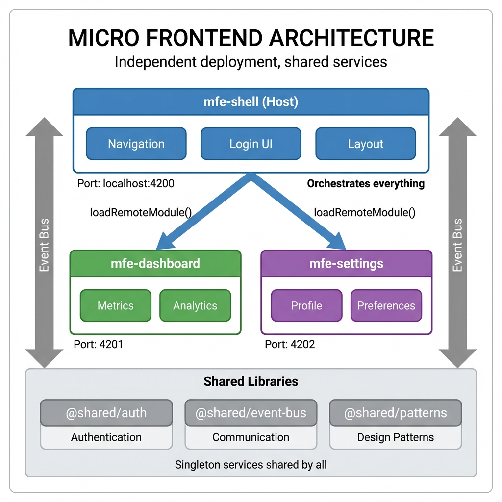
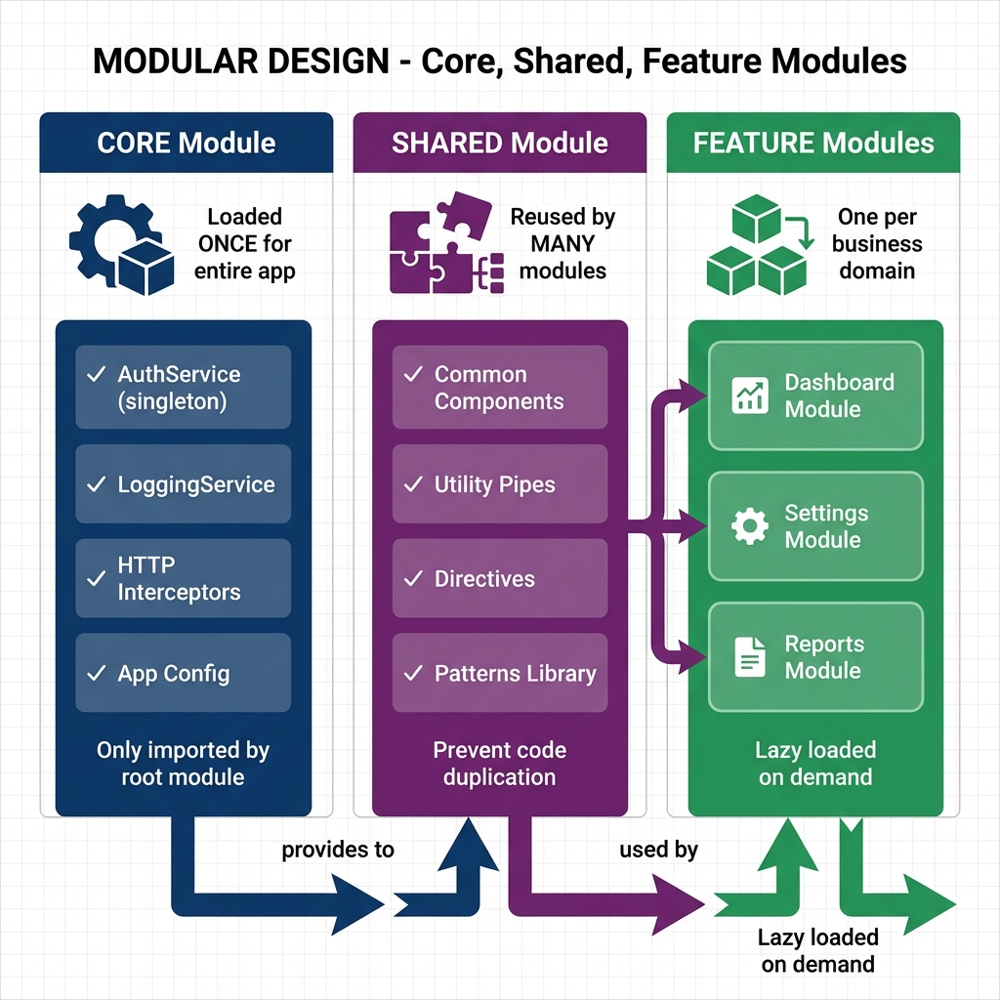
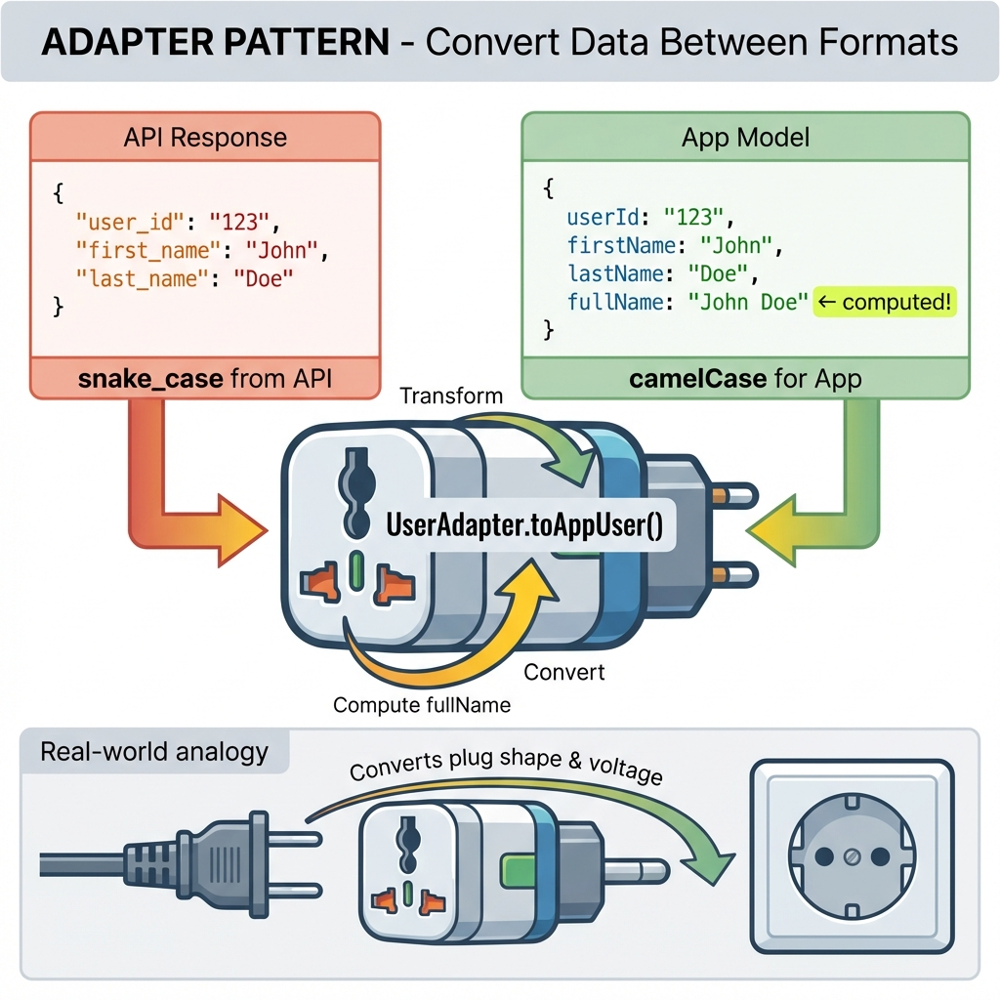
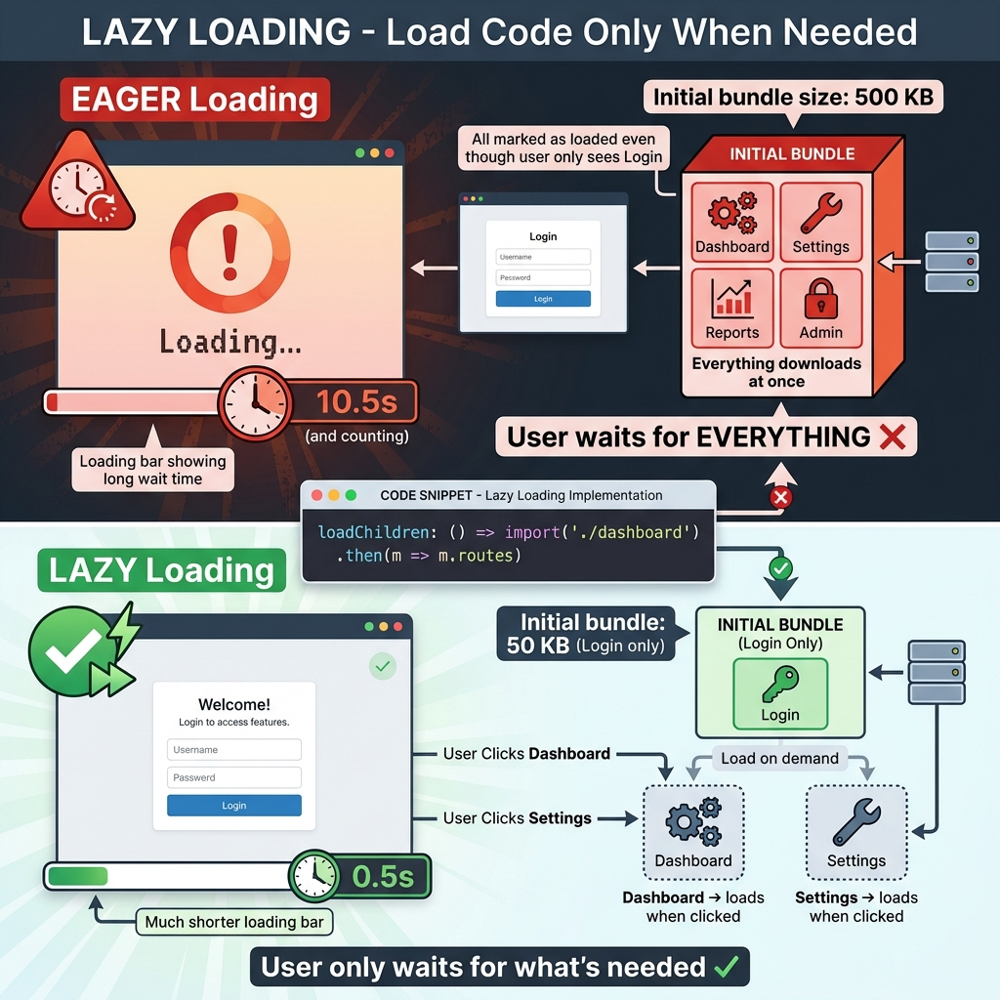
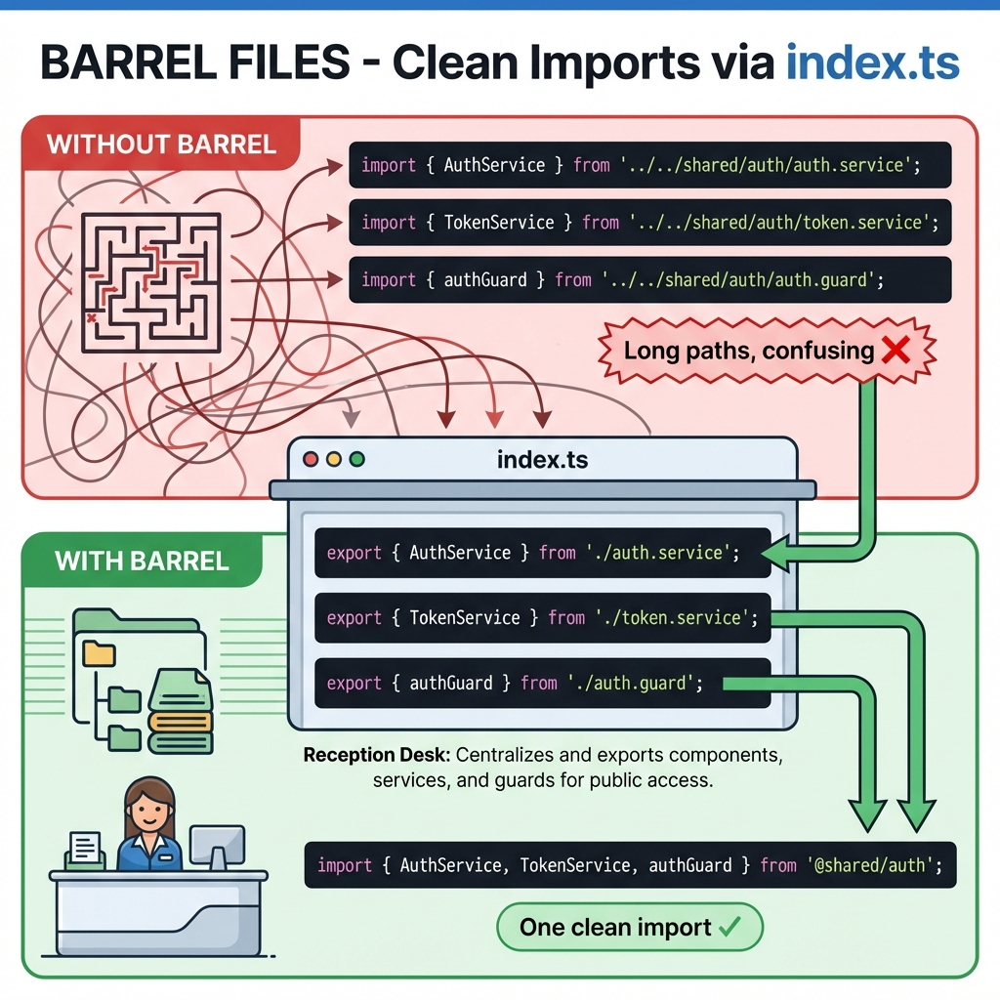
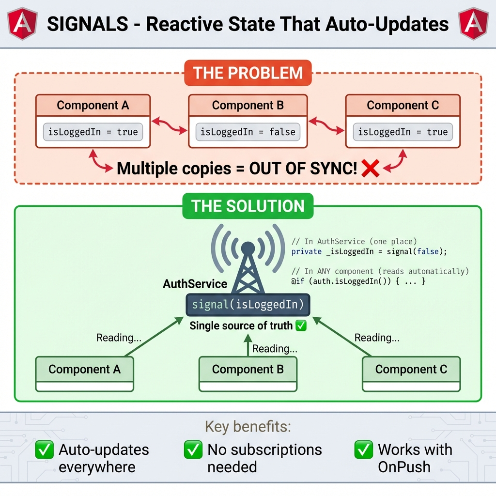

# 🎓 Design Patterns Visual Guide

> **A visual learning guide with images explaining each design pattern in this project**

---

## 1. 🏗️ Micro Frontend Architecture

The overall architecture of this project - how Shell, Dashboard, and Settings work together.

**Key Points:**
- **Shell** (port 4200) - Orchestrates and loads remote MFEs
- **Dashboard** (port 4201) - Metrics and analytics features
- **Settings** (port 4202) - Profile and preferences
- **Shared Libraries** - Singleton services shared by all MFEs

---

## 2. 🧱 Modular Design (Core, Shared, Feature)

How to organize your code into three types of modules.

**Key Points:**
- **Core Module** - Loaded once (AuthService, Interceptors)
- **Shared Module** - Reused by many (Components, Pipes)
- **Feature Modules** - One per business domain (Dashboard, Settings)

**In This Project:**
- Core: `@shared/auth`, `@shared/event-bus`
- Shared: `@shared/patterns`
- Features: `mfe-dashboard`, `mfe-settings`

---

## 3. 🎭 Facade Pattern

Hide complexity behind simple methods - like a TV remote control.

**Key Points:**
- **Without Facade**: Component knows about TokenService, API, Encryption, Storage
- **With Facade**: Component just calls `authService.login()`
- All complexity is hidden inside the facade

**In This Project:**
- `AuthService` is the facade
- File: `shared/auth/auth.service.ts`

---

## 4. 🔄 Adapter Pattern

Convert data from one format to another - like a travel power adapter.

**Key Points:**
- API returns `snake_case` → Adapter → App uses `camelCase`
- Can add computed properties (e.g., `fullName`)
- Keeps API changes from breaking your app

**In This Project:**
- `UserAdapter`, `MetricsAdapter`
- File: `shared/patterns/api-adapter.ts`

---

## 5. 🎨 Smart vs Presentational Components

Separate brain (logic) from beauty (display).

**Key Points:**
- **Smart Component**: Injects services, fetches data, handles logic
- **Presentational Component**: Only `@Input()` and `@Output()`, no services
- Smart = Kitchen (does the cooking), Presentational = Waiter (serves beautifully)

**In This Project:**
- `MetricCardComponent` is a presentational component
- File: `shared/patterns/metric-card.component.ts`

---

## 6. 🛡️ Proxy Pattern (Caching)

Add extra behavior (caching) to API calls - like a secretary who remembers answers.

**Key Points:**
- **Without Proxy**: Every request hits the API (slow)
- **With Proxy**: First request cached, subsequent requests instant
- 3 requests: 1500ms → 510ms (3x faster!)

**In This Project:**
- `CachingProxyService`
- File: `shared/patterns/caching-proxy.service.ts`

---

## 7. ⚡ Lazy Loading

Load code only when needed - like a buffet restaurant.

**Key Points:**
- **Eager Loading**: Everything downloads at once (500 KB, 10+ seconds)
- **Lazy Loading**: Only what's needed (50 KB, 0.5 seconds)
- User only waits for what they actually use

**In This Project:**
- `loadRemoteModule()` in routes
- File: `mfe-shell/src/app/app.routes.ts`

---

## 8. 📦 Barrel Files (Public API)

One `index.ts` file exports everything - like a reception desk.

**Key Points:**
- **Without Barrel**: Long confusing import paths
- **With Barrel**: One clean import from `@shared/auth`
- `index.ts` acts as the "menu" of available exports

**In This Project:**
- Files: `shared/auth/index.ts`, `shared/event-bus/index.ts`, `shared/patterns/index.ts`

---

## 9. 📡 Signals (State Management)

Reactive state that auto-updates everywhere - like a bulletin board.

**Key Points:**
- **The Problem**: Multiple copies get out of sync
- **The Solution**: One Signal as single source of truth
- All components read from the same Signal automatically

**In This Project:**
- `signal()` and `computed()` in AuthService
- File: `shared/auth/auth.service.ts`

---

## Quick Reference

| Pattern | Image | Key Analogy |
|---------|-------|-------------|
| Modular Design | Core/Shared/Feature boxes | LEGO blocks |
| Facade | Simple interface hiding complexity | TV Remote |
| Adapter | Data transformation | Power Adapter |
| Smart/Presentational | Brain vs Display | Kitchen vs Waiter |
| Proxy (Caching) | Request interception | Secretary |
| Lazy Loading | On-demand code | Buffet Restaurant |
| Barrel Files | Centralized exports | Reception Desk |
| Signals | Reactive state | Bulletin Board |

---

> **Tip**: Open each image to zoom in and see the code examples clearly!
