# 🎭 Single-SPA - Complete Guide

> **The Framework-Agnostic Micro Frontend Orchestrator**

## 📑 Table of Contents

1. [What is Single-SPA?](#what-is-single-spa)
2. [Core Concepts](#core-concepts)
3. [Architecture](#architecture)
4. [How It Works](#how-it-works)
5. [Implementation Guide](#implementation-guide)
6. [Angular Integration](#angular-integration)
7. [Multi-Framework Example](#multi-framework-example)
8. [Advantages](#advantages)
9. [Disadvantages](#disadvantages)
10. [Performance Considerations](#performance-considerations)
11. [When to Use Single-SPA](#when-to-use-single-spa)
12. [Comparison with Module Federation](#comparison-with-module-federation)
13. [Why This Project Uses Native Federation Instead](#why-this-project-uses-native-federation-instead)

---

## What is Single-SPA?

**Single-SPA** (Single Single Page Application) is a JavaScript framework that enables you to build micro frontends by combining multiple independent applications—potentially written in different frameworks—into one cohesive application.

### Simple Analogy

> 🎭 **Theater Director Analogy**
> 
> Imagine a theater with one stage where different acting troupes (Angular, React, Vue) can perform. Single-SPA is like the **theater director** who:
> - Decides which troupe performs based on the scene (URL)
> - Tells troupes when to enter (mount) and exit (unmount)
> - Ensures smooth transitions between performances
> - Coordinates shared resources (props, lighting = shared dependencies)

### Key Definition

```
┌─────────────────────────────────────────────────────────────────────────┐
│                         SINGLE-SPA                                      │
│                                                                         │
│   A JavaScript router for front-end microservices that allows you      │
│   to use multiple frameworks on the same page without refreshing.       │
│                                                                         │
│   ✅ Framework Agnostic    ✅ Independent Deployment                    │
│   ✅ Lazy Loading          ✅ Shared Dependencies                       │
└─────────────────────────────────────────────────────────────────────────┘
```

---

## Core Concepts

### 1. Root Config (Orchestrator)

The central application that coordinates all micro frontends.

```javascript
// root-config.js - The "Theater Director"
import { registerApplication, start } from 'single-spa';

// Register each micro frontend
registerApplication({
  name: '@org/dashboard',           // Unique app name
  app: () => System.import('@org/dashboard'), // How to load
  activeWhen: ['/dashboard'],       // When to show
});

registerApplication({
  name: '@org/settings',
  app: () => System.import('@org/settings'),
  activeWhen: ['/settings'],
});

// Start the orchestrator
start();
```

### 2. Applications (Micro Frontends)

Each micro frontend must export lifecycle functions:

```javascript
// dashboard/src/main.single-spa.ts
export function bootstrap(props) {
  // Called once when app is first loaded
  return Promise.resolve();
}

export function mount(props) {
  // Called every time app becomes active
  // Render your app here
  return Promise.resolve();
}

export function unmount(props) {
  // Called when app becomes inactive
  // Clean up resources here
  return Promise.resolve();
}
```

### 3. Lifecycle Functions Explained

```
┌─────────────────────────────────────────────────────────────────────────┐
│                    SINGLE-SPA LIFECYCLE                                 │
├─────────────────────────────────────────────────────────────────────────┤
│                                                                         │
│    ┌──────────┐     ┌───────────┐     ┌─────────┐     ┌───────────┐    │
│    │  LOAD    │────▶│ BOOTSTRAP │────▶│  MOUNT  │────▶│  UNMOUNT  │    │
│    │          │     │  (once)   │     │  (many) │     │  (many)   │    │
│    └──────────┘     └───────────┘     └─────────┘     └───────────┘    │
│         │                                  ▲              │            │
│         │                                  └──────────────┘            │
│         │                              (route changes)                 │
│         │                                                              │
│         ▼                                                              │
│    ┌──────────────────────────────────────────────────────────────┐    │
│    │  LOAD: Download and parse the JavaScript bundle              │    │
│    │  BOOTSTRAP: One-time initialization (called once)            │    │
│    │  MOUNT: Render the app into the DOM (called on activation)   │    │
│    │  UNMOUNT: Remove the app from DOM (called on deactivation)   │    │
│    └──────────────────────────────────────────────────────────────┘    │
│                                                                         │
└─────────────────────────────────────────────────────────────────────────┘
```

### 4. Activity Functions

Determine when each app should be active:

```javascript
// Simple: Prefix matching
activeWhen: ['/dashboard']  // Active for /dashboard, /dashboard/stats, etc.

// Advanced: Custom function
activeWhen: (location) => {
  return location.pathname.startsWith('/dashboard') && 
         !location.pathname.includes('/admin');
}
```

---

## Architecture

### High-Level Architecture

```
┌─────────────────────────────────────────────────────────────────────────┐
│                           BROWSER                                       │
├─────────────────────────────────────────────────────────────────────────┤
│                                                                         │
│    ┌─────────────────────────────────────────────────────────────┐     │
│    │                   SINGLE-SPA ROOT CONFIG                     │     │
│    │                     (Orchestrator)                           │     │
│    │  • Registers all applications                                │     │
│    │  • Listens to route changes                                  │     │
│    │  • Manages lifecycle (mount/unmount)                         │     │
│    │  • Handles shared dependencies via Import Maps               │     │
│    └──────────────────────────┬──────────────────────────────────┘     │
│                               │                                         │
│           ┌───────────────────┼───────────────────┐                    │
│           │                   │                   │                    │
│           ▼                   ▼                   ▼                    │
│    ┌─────────────┐     ┌─────────────┐     ┌─────────────┐            │
│    │   ANGULAR   │     │    REACT    │     │     VUE     │            │
│    │    MFE      │     │    MFE      │     │    MFE      │            │
│    │             │     │             │     │             │            │
│    │ /dashboard  │     │ /reports    │     │ /settings   │            │
│    └─────────────┘     └─────────────┘     └─────────────┘            │
│                                                                         │
│    ┌─────────────────────────────────────────────────────────────┐     │
│    │                  SHARED DEPENDENCIES                         │     │
│    │        (Loaded via SystemJS / Import Maps)                   │     │
│    │   rxjs | lodash | moment | shared-utils | design-system     │     │
│    └─────────────────────────────────────────────────────────────┘     │
│                                                                         │
└─────────────────────────────────────────────────────────────────────────┘
```

### Deployment Architecture

```
┌─────────────────────────────────────────────────────────────────────────┐
│                     DEPLOYMENT ARCHITECTURE                             │
├─────────────────────────────────────────────────────────────────────────┤
│                                                                         │
│    ┌────────────────────────────────────────────────────────────────┐  │
│    │                         CDN                                     │  │
│    │  https://cdn.example.com                                        │  │
│    │                                                                 │  │
│    │  ├── /root-config/                                              │  │
│    │  │   └── main.js  ◄────── Orchestrator                         │  │
│    │  │                                                              │  │
│    │  ├── /dashboard/                                                │  │
│    │  │   └── main.js  ◄────── Angular App (Team A deploys)         │  │
│    │  │                                                              │  │
│    │  ├── /reports/                                                  │  │
│    │  │   └── main.js  ◄────── React App (Team B deploys)           │  │
│    │  │                                                              │  │
│    │  ├── /settings/                                                 │  │
│    │  │   └── main.js  ◄────── Vue App (Team C deploys)             │  │
│    │  │                                                              │  │
│    │  └── /shared/                                                   │  │
│    │      ├── rxjs.js                                                │  │
│    │      └── design-system.js  ◄────── Common dependencies         │  │
│    └────────────────────────────────────────────────────────────────┘  │
│                                                                         │
│    Each team deploys independently to their own path!                  │
│                                                                         │
└─────────────────────────────────────────────────────────────────────────┘
```

---

## How It Works

### Step-by-Step Flow

```
┌─────────────────────────────────────────────────────────────────────────┐
│                    SINGLE-SPA RUNTIME FLOW                              │
├─────────────────────────────────────────────────────────────────────────┤
│                                                                         │
│  1. User visits: https://app.example.com/dashboard                     │
│     │                                                                   │
│     ▼                                                                   │
│  2. Browser loads root-config.js (orchestrator)                        │
│     │                                                                   │
│     ▼                                                                   │
│  3. Single-SPA checks all registered apps against current URL          │
│     │                                                                   │
│     ├── @org/navbar      → activeWhen: '/' → ✅ MATCH → Load & Mount   │
│     ├── @org/dashboard   → activeWhen: '/dashboard' → ✅ MATCH         │
│     └── @org/settings    → activeWhen: '/settings' → ❌ No Match       │
│     │                                                                   │
│     ▼                                                                   │
│  4. Matched apps are loaded (if not already) and mounted               │
│     │                                                                   │
│     ▼                                                                   │
│  5. User navigates to /settings                                        │
│     │                                                                   │
│     ▼                                                                   │
│  6. Single-SPA:                                                         │
│     ├── Unmounts @org/dashboard (calls unmount lifecycle)              │
│     ├── Keeps @org/navbar mounted (still matches '/')                  │
│     └── Mounts @org/settings (calls bootstrap if first time, then mount)│
│                                                                         │
└─────────────────────────────────────────────────────────────────────────┘
```

### Import Maps for Dependency Sharing

```html
<!-- index.html -->
<script type="systemjs-importmap">
{
  "imports": {
    "@org/root-config": "https://cdn.example.com/root-config/main.js",
    "@org/dashboard": "https://cdn.example.com/dashboard/main.js",
    "@org/settings": "https://cdn.example.com/settings/main.js",
    
    "rxjs": "https://cdn.example.com/shared/rxjs.min.js",
    "lodash": "https://cdn.example.com/shared/lodash.min.js"
  }
}
</script>
<script src="https://cdn.jsdelivr.net/npm/systemjs/dist/system.min.js"></script>
```

---

## Implementation Guide

### Step 1: Create Root Config

```bash
npx create-single-spa --moduleType root-config
```

```javascript
// src/root-config.js
import { registerApplication, start } from 'single-spa';

// Utility parcel (always visible - navbar, footer)
registerApplication({
  name: '@org/navbar',
  app: () => System.import('@org/navbar'),
  activeWhen: ['/'],
  customProps: { authToken: getAuthToken() }
});

// Dashboard MFE (Angular)
registerApplication({
  name: '@org/dashboard',
  app: () => System.import('@org/dashboard'),
  activeWhen: ['/dashboard'],
});

// Reports MFE (React)
registerApplication({
  name: '@org/reports',
  app: () => System.import('@org/reports'),
  activeWhen: ['/reports'],
});

// Settings MFE (Vue)
registerApplication({
  name: '@org/settings',
  app: () => System.import('@org/settings'),
  activeWhen: ['/settings'],
});

start({
  urlRerouteOnly: true, // Performance optimization
});
```

### Step 2: Create Layout

```html
<!-- index.html -->
<!DOCTYPE html>
<html>
<head>
  <meta charset="utf-8">
  <title>Single-SPA App</title>
  
  <!-- Import Map for dependency URLs -->
  <script type="systemjs-importmap">
    {
      "imports": {
        "single-spa": "https://cdn.jsdelivr.net/npm/single-spa@5/lib/system/single-spa.min.js",
        "@org/root-config": "//localhost:9000/root-config.js",
        "@org/navbar": "//localhost:8081/main.js",
        "@org/dashboard": "//localhost:8082/main.js",
        "@org/reports": "//localhost:8083/main.js",
        "@org/settings": "//localhost:8084/main.js"
      }
    }
  </script>
  
  <script src="https://cdn.jsdelivr.net/npm/systemjs/dist/system.min.js"></script>
</head>
<body>
  <!-- Container for navbar (always visible) -->
  <div id="navbar-container"></div>
  
  <!-- Container for main content (switches based on route) -->
  <main id="single-spa-container"></main>
  
  <!-- Bootstrap root config -->
  <script>
    System.import('@org/root-config');
  </script>
</body>
</html>
```

### Step 3: Configure Each Micro Frontend

Each MFE exports lifecycle hooks. Here's how to wrap an existing app:

---

## Angular Integration

### Install single-spa-angular

```bash
ng add single-spa-angular
```

This automatically:
- Creates `main.single-spa.ts`
- Updates `angular.json` for single-spa build
- Adds necessary configuration

### Generated Entry Point

```typescript
// src/main.single-spa.ts
import { enableProdMode, NgZone } from '@angular/core';
import { platformBrowserDynamic } from '@angular/platform-browser-dynamic';
import { singleSpaAngular, getSingleSpaExtraProviders } from 'single-spa-angular';
import { AppModule } from './app/app.module';
import { environment } from './environments/environment';

if (environment.production) {
  enableProdMode();
}

// Single-SPA lifecycle wrapper for Angular
const lifecycles = singleSpaAngular({
  bootstrapFunction: (singleSpaProps) => {
    return platformBrowserDynamic(getSingleSpaExtraProviders()).bootstrapModule(AppModule);
  },
  template: '<app-root />',
  Router: Router,
  NgZone,
  domElementGetter: () => document.getElementById('single-spa-container'),
});

// Export lifecycle functions
export const bootstrap = lifecycles.bootstrap;
export const mount = lifecycles.mount;
export const unmount = lifecycles.unmount;
```

### Angular Configuration

```json
// angular.json (partial)
{
  "projects": {
    "dashboard": {
      "architect": {
        "build": {
          "builder": "@angular-devkit/build-angular:browser",
          "options": {
            "outputPath": "dist/dashboard",
            "main": "src/main.single-spa.ts",  // ✅ Use single-spa entry
            "deployUrl": "//localhost:8082/"
          }
        }
      }
    }
  }
}
```

### Routing Configuration

```typescript
// app-routing.module.ts
import { APP_BASE_HREF } from '@angular/common';

@NgModule({
  imports: [RouterModule.forRoot(routes)],
  providers: [
    { provide: APP_BASE_HREF, useValue: '/dashboard' }  // ✅ Base href for MFE
  ]
})
export class AppRoutingModule { }
```

---

## Multi-Framework Example

### Root Config with Mixed Frameworks

```javascript
// root-config.js
import { registerApplication, start } from 'single-spa';

// Angular Dashboard
registerApplication({
  name: '@company/dashboard',
  app: () => System.import('@company/dashboard'),
  activeWhen: '/dashboard',
});

// React Reports (migrated from Angular)
registerApplication({
  name: '@company/reports',
  app: () => System.import('@company/reports'),
  activeWhen: '/reports',
});

// Vue Admin Panel
registerApplication({
  name: '@company/admin',
  app: () => System.import('@company/admin'),
  activeWhen: '/admin',
});

// Svelte Widgets (experimental)
registerApplication({
  name: '@company/widgets',
  app: () => System.import('@company/widgets'),
  activeWhen: '/widgets',
});

start();
```

### Visual Representation

```
┌─────────────────────────────────────────────────────────────────────────┐
│                    MULTI-FRAMEWORK SINGLE-SPA                           │
├─────────────────────────────────────────────────────────────────────────┤
│                                                                         │
│   URL: https://app.example.com                                          │
│                                                                         │
│   ┌─────────────────────────────────────────────────────────────────┐  │
│   │  🟢 NAVBAR (React) - Always Mounted                              │  │
│   │  [Dashboard] [Reports] [Admin] [Widgets]                        │  │
│   └─────────────────────────────────────────────────────────────────┘  │
│                                                                         │
│   ┌─────────────────────────────────────────────────────────────────┐  │
│   │                                                                  │  │
│   │   /dashboard     │   /reports     │   /admin     │  /widgets   │  │
│   │   ┌──────────┐   │   ┌──────────┐ │  ┌─────────┐ │ ┌─────────┐ │  │
│   │   │ ANGULAR  │   │   │  REACT   │ │  │   VUE   │ │ │ SVELTE  │ │  │
│   │   │          │   │   │          │ │  │         │ │ │         │ │  │
│   │   │ Charts   │   │   │ Tables   │ │  │ Users   │ │ │ Custom  │ │  │
│   │   │ Metrics  │   │   │ Exports  │ │  │ Roles   │ │ │ Widgets │ │  │
│   │   └──────────┘   │   └──────────┘ │  └─────────┘ │ └─────────┘ │  │
│   │                                                                  │  │
│   └─────────────────────────────────────────────────────────────────┘  │
│                                                                         │
│   ┌─────────────────────────────────────────────────────────────────┐  │
│   │  🟢 FOOTER (Web Component) - Always Mounted                      │  │
│   └─────────────────────────────────────────────────────────────────┘  │
│                                                                         │
└─────────────────────────────────────────────────────────────────────────┘
```

---

## Advantages

| Advantage | Description |
|-----------|-------------|
| **Framework Freedom** | Use Angular, React, Vue, Svelte, or any framework together |
| **Incremental Migration** | Migrate legacy apps one piece at a time |
| **Team Autonomy** | Each team chooses their preferred framework |
| **Independent Deployment** | Deploy any MFE without affecting others |
| **Lazy Loading** | Load apps only when needed |
| **Production Proven** | Used by large enterprises (Spotify, IKEA, etc.) |
| **Active Community** | Strong ecosystem with framework-specific wrappers |
| **Flexible Routing** | Complex route matching with custom activity functions |

### Best Use Cases

```
✅ IDEAL FOR:
├── Large enterprise with multiple teams using different frameworks
├── Legacy migration (gradually moving from AngularJS to React)
├── Acquisitions (integrating apps from acquired companies)
├── Experimentation (trying new frameworks in production)
└── Complex routing requirements with mixed frameworks
```

---

## Disadvantages

| Disadvantage | Description | Mitigation |
|--------------|-------------|------------|
| **Complexity** | More moving parts than single-framework solutions | Good documentation, training |
| **Bundle Size** | Multiple frameworks = larger total bundle | Careful shared dependency management |
| **Learning Curve** | Team must understand single-spa + SystemJS/Import Maps | Invest in onboarding |
| **Debugging** | Harder to trace issues across frameworks | Centralized logging, source maps |
| **Styling Conflicts** | CSS can bleed between apps | CSS modules, Shadow DOM, BEM |
| **Version Conflicts** | Different React versions may conflict | Strict version management |
| **Performance Overhead** | Runtime orchestration has cost | Preloading, caching strategies |

### When NOT to Use

```
❌ AVOID IF:
├── Single-framework team (use Module Federation instead)
├── Small project or team
├── Performance-critical applications
├── Limited DevOps capacity
└── No multi-framework requirement
```

---

## Performance Considerations

### Loading Strategies

```typescript
// 1. Preload critical apps
registerApplication({
  name: '@org/dashboard',
  app: () => System.import('@org/dashboard'),
  activeWhen: '/dashboard',
});

// Preload dashboard immediately (likely first click)
System.import('@org/dashboard'); // Start loading in background

// 2. Lazy load non-critical apps
registerApplication({
  name: '@org/settings',
  app: () => System.import('@org/settings'),
  activeWhen: '/settings',
  // Only loads when user navigates to /settings
});
```

### Performance Metrics

| Metric | Typical Impact | Optimization |
|--------|---------------|--------------|
| **Initial Load** | +200-500ms overhead | Preload critical paths |
| **Route Switch** | 50-200ms (first load) | Keep apps mounted when possible |
| **Bundle Size** | +50-100KB (single-spa core) | Tree shake, use esm-bundle |
| **Memory** | Each framework = +memory | Unmount inactive apps |

### Optimization Tips

```javascript
// root-config.js with optimizations

// 1. Use urlRerouteOnly for better performance
start({ urlRerouteOnly: true });

// 2. Preload apps user is likely to visit
window.addEventListener('load', () => {
  // After initial load, preload other apps
  setTimeout(() => {
    System.import('@org/dashboard');
    System.import('@org/settings');
  }, 3000); // Wait 3s after initial load
});

// 3. Keep frequently used apps mounted
registerApplication({
  name: '@org/navbar',
  app: () => System.import('@org/navbar'),
  activeWhen: () => true, // Always active, never unmounted
});
```

---

## When to Use Single-SPA

### Decision Flowchart

```mermaid
flowchart TD
    A[Do you need micro frontends?] --> B{Multiple frameworks?}
    
    B -->|Yes - Angular + React + Vue| C[✅ Single-SPA]
    B -->|No - Single framework| D{Which framework?}
    
    D -->|Angular 17+| E[Use Native Federation]
    D -->|Angular 12-16 or React| F[Use Webpack Module Federation]
    D -->|Vite-based| G[Use Vite Federation]
    
    C --> H[Good for:]
    H --> I[Legacy migration]
    H --> J[Multi-team with different stacks]
    H --> K[Enterprise with acquisitions]
    
    style C fill:#22c55e,stroke:#16a34a,color:#fff
```



### Quick Decision Table

| Scenario | Use Single-SPA? | Alternative |
|----------|----------------|-------------|
| All Angular team | ❌ No | Native/Webpack Module Federation |
| Angular + React migration | ✅ Yes | - |
| React + Vue + Svelte | ✅ Yes | - |
| Embedding 3rd-party apps | ⚠️ Maybe | iframe for isolation |
| Maximum performance needed | ❌ No | Module Federation |
| Complete isolation required | ❌ No | iframe |

---

## Comparison with Module Federation

| Aspect | Single-SPA | Module Federation |
|--------|------------|-------------------|
| **Primary Purpose** | Multi-framework orchestration | Same-framework code sharing |
| **Framework Support** | Any framework | Best with single framework |
| **Shared Dependencies** | Via Import Maps/SystemJS | Built-in sharing |
| **Build Tool** | Any (need adapter) | Webpack/esbuild |
| **Learning Curve** | Higher | Lower |
| **Bundle Size** | Larger (multiple frameworks) | Smaller (optimized sharing) |
| **Use Together?** | ✅ Yes, can combine both | ✅ Yes |
| **Best For** | Migration, multi-framework | Performance, single framework |

### Using Both Together

```
┌─────────────────────────────────────────────────────────────────────────┐
│                  SINGLE-SPA + MODULE FEDERATION                         │
├─────────────────────────────────────────────────────────────────────────┤
│                                                                         │
│   ┌─────────────────────────────────────────────────────────────────┐  │
│   │                  Single-SPA Root Config                          │  │
│   │             (Orchestrates framework switching)                   │  │
│   └───────────┬─────────────────────────────────┬───────────────────┘  │
│               │                                 │                       │
│               ▼                                 ▼                       │
│   ┌───────────────────────────┐   ┌───────────────────────────┐        │
│   │    ANGULAR MFEs           │   │    REACT MFEs             │        │
│   │  (Module Federation)      │   │  (Module Federation)      │        │
│   │                           │   │                           │        │
│   │  ┌─────────┐ ┌─────────┐  │   │  ┌─────────┐ ┌─────────┐  │        │
│   │  │Dashboard│ │Settings │  │   │  │ Reports │ │Analytics│  │        │
│   │  └─────────┘ └─────────┘  │   │  └─────────┘ └─────────┘  │        │
│   │      ↕ Shared via MF      │   │      ↕ Shared via MF      │        │
│   └───────────────────────────┘   └───────────────────────────┘        │
│                                                                         │
│   Angular team uses Module Federation internally                        │
│   React team uses Module Federation internally                          │
│   Single-SPA coordinates between the two ecosystems                     │
│                                                                         │
└─────────────────────────────────────────────────────────────────────────┘
```

---

## Why This Project Uses Native Federation Instead

> [!IMPORTANT]
> **This Angular 19 MFE project uses Native Federation, not Single-SPA.**

### Reasoning

| Factor | This Project | Single-SPA Benefit |
|--------|--------------|-------------------|
| **Framework Mix** | Angular only | ❌ Not needed |
| **Team Stack** | Single Angular team | ❌ Not needed |
| **Performance Priority** | High | ❌ Single-SPA adds overhead |
| **Simplicity** | Preferred | ❌ Single-SPA is more complex |
| **Migration Need** | None | ❌ Not needed |

### When We Would Use Single-SPA

We would consider Single-SPA if:
- ✅ We acquired a company with React-based applications
- ✅ A team wanted to experiment with Vue or Svelte
- ✅ We needed to embed third-party widgets from different stacks
- ✅ We were migrating a legacy AngularJS application incrementally

### Current Choice: Native Federation

```
┌─────────────────────────────────────────────────────────────────────────┐
│                     THIS PROJECT'S ARCHITECTURE                         │
├─────────────────────────────────────────────────────────────────────────┤
│                                                                         │
│   ┌─────────────────────────────────────────────────────────────────┐  │
│   │              Native Federation (Shell Host)                      │  │
│   │                      mfe-shell                                   │  │
│   └───────────┬───────────────────────────────────┬─────────────────┘  │
│               │                                   │                     │
│               ▼                                   ▼                     │
│   ┌─────────────────────────┐       ┌─────────────────────────┐        │
│   │     mfe-dashboard       │       │     mfe-settings        │        │
│   │      (Angular 19)       │       │      (Angular 19)       │        │
│   └─────────────────────────┘       └─────────────────────────┘        │
│                                                                         │
│   ✅ Simple configuration                                               │
│   ✅ Fast esbuild compilation                                           │
│   ✅ Native ES modules                                                  │
│   ✅ Automatic shared dependencies                                      │
│   ✅ No SystemJS/Import Maps complexity                                 │
│                                                                         │
└─────────────────────────────────────────────────────────────────────────┘
```

---

## Resources

### Official Documentation
- [Single-SPA Docs](https://single-spa.js.org/)
- [single-spa-angular](https://single-spa.js.org/docs/ecosystem-angular)
- [single-spa-react](https://single-spa.js.org/docs/ecosystem-react)
- [single-spa-vue](https://single-spa.js.org/docs/ecosystem-vue)

### Useful Tools
- `create-single-spa` - CLI for scaffolding
- `single-spa-inspector` - Browser DevTools extension
- `import-map-overrides` - Dev tool for local development

---

> **Summary**: Single-SPA is the go-to solution when you need to combine multiple JavaScript frameworks in one application. For single-framework projects like this Angular MFE, Native/Webpack Module Federation provides better performance and simpler configuration.
